# 🔬 Master Synthesis: Literature Taxonomy & Research Gaps for Thesis

This document synthesizes the core findings, mathematical methods, and open research gaps identified across **118 research papers** (108 ingested PDFs + 10 web-discovered notes) in your Obsidian Second Brain.

> [!NOTE]
> Last updated: 2026-08-26 (counts refreshed against vault state) | Covers all 118 papers | Refreshed after ingestion of papers 81–103 (see [Refresh Section](#-refresh-papers-81103-spatial-temporal-transfer-benchmarks--probabilistic-lines)) and gap-targeted web-discovered papers 104–108 (see [Batch 4 Refresh](#-batch-4-refresh-papers-104108-web-discovered-gap-targeted-added-2026-08-23)) | **NEW: cross-cutting Methodology & System-level Gaps M-1..M-5 added**

---

## 🏛️ Comprehensive Literature Taxonomy

```mermaid
graph TD
    A[EV Load & Energy Demand Forecasting] --> B[1. Single-Station & Local Forecasting]
    A --> C[2. City-Level & Multi-Station Spatial-Temporal]
    A --> D[3. Probabilistic & Uncertainty Quantification]
    A --> E[4. Data Scarcity, Transfer & Federated Learning]
    A --> F[5. Downstream V2G Control & Market Participation]
    A --> G[6. Next-Generation Architectures]
    A --> H[7. Signal Decomposition & Hybrid Methods]

    B --> B1["LSTM / BiLSTM / GRU Baselines (Zhu 2019×2, Hippert 2001)"]
    B --> B2["CNN-LSTM-Attention & CAT-Former (Romia 2026, Hussain 2025)"]
    B --> B3["MLP & XGBoost Competitive Baselines (Bampos 2024)"]
    B --> B4["LSTM-Transformer Hybrid (Feng 2024, Hussain 2025)"]
    B --> B5["Autoformer Decomposition (Helmy 2024)"]

    C --> C1["Physics-Informed Attention Graph PAG (Qu 2024)"]
    C --> C2["GCN-TRN Spatial Transformer (Zhang 2022)"]
    C --> C3["Multi-Scale Spatial-Temporal GAT MSSTGAN (Tian 2025)"]
    C --> C4["EV-STLLM Large Language Model (Fan 2025)"]
    C --> C5["REST Network ResNet+SENet+Transformer (Alghamdi 2025)"]
    C --> C6["Multi-Scale Fusion Transformer MFT (Liu 2026)"]
    C --> C7["EVformer Decoupled ST Transformer (Jia 2026)"]
    C --> C8["TriCast Tri-Modal Causal w/ Price Elasticity (Wang X. 2026)"]

    D --> D1["PICNN Convex Quantile Learning (Zheng 2025)"]
    D --> D2["Feature-Enhanced FEDM (Cao 2024)"]
    D --> D3["Multi-Quantile TCN & Pinball Loss (Ali 2024, Matrone 2025)"]
    D --> D4["DiffPLF Conditional Diffusion DDPM (Li 2024)"]
    D --> D5["Deep Gaussian Process DGP (Cao 2022)"]
    D --> D6["Conformal Prediction DER (Zhou 2024)"]
    D --> D7["DeepAR Autoregressive RNN (Salinas 2020)"]
    D --> D8["USDT Dual-Direction Probabilistic Transformer (Zhang J. 2026)"]
    D --> D9["TFT + Conformal (CQR) Post-Hoc Calibration (MoghadamDost 2026)"]

    E --> E1["MetaProbformer Reptile Meta-Learning (Huang 2023)"]
    E --> E2["Inductive Transfer Learning MQ-TCN (Ali 2024)"]
    E --> E3["VMD + Prophet-LSTM Hybrid (Cheng 2023)"]
    E --> E4["Vertical Federated EGAT-LSTM (Han 2025)"]
    E --> E5["Personalized Federated pFed (Zhu 2025)"]
    E --> E6["Divide & Conquer Transformer Smart Meter (Ke 2024)"]
    E --> E7["MixerInformer Two-Stage Transfer for NEW Stations (Zhou Z. 2025)"]
    E --> E8["MAML-Informer Probabilistic Meta-Learning per Station (Singh 2026)"]
    E --> E9["ML Geographical Transferability Benchmark (Wang S. 2026)"]

    F --> F1["Lyapunov Virtual Queue Dispatch (Huang 2021)"]
    F --> F2["V2G-SVE Value Metric (Zhong 2024)"]
    F --> F3["ADMM EVSFD Schedulable Capacity (Xu 2024)"]
    F --> F4["Multiscenario Stochastic MS-MPC (Yang 2025)"]
    F --> F5["Multiplicative Trend DAM Bidding (Bampos 2024)"]
    F --> F6["QoQ Queuing Model (Zhang 2021, Alizadeh 2014)"]

    G --> G1["Mamba-3 Selective SSM O(N) (Lahoti 2026)"]
    G --> G2["HyKANet Mamba + KAN (Hao 2026)"]
    G --> G3["PC-M3 Physics-Constrained Mamba MIMO (Chen 2026)"]
    G --> G4["Time Series Foundation Models Benchmark (Meyer 2025)"]
    G --> G5["EV-STLLM LoRA Fine-Tuned LLM (Fan 2025)"]

    H --> H1["BWO-ICEEMDAN-iTransformer Signal Decomp (Zheng 2025)"]
    H --> H2["VMD + Prophet + LSTM Hybrid (Cheng 2023)"]
    H --> H3["ResMMoT-Informer DWT + MoE (Bao 2025)"]
    H --> H4["Wavelet-CNN Ensemble (Zhang 2021)"]
```

---

## 🔑 Key Mathematical & Methodological Discoveries

### From Original 33 Papers

1. **Quantile Crossing Elimination via Convex Learning**:
   - Standard quantile regression frequently produces quantile inversion ($q_{0.2} > q_{0.8}$).
   - **PICNN Solution ([[2025_Coherent_Hierarchical_EV_Load]])**: Learns a partially convex function $f(\alpha, h)$, taking its gradient $q(\alpha | h) = \nabla_\alpha f(\alpha, h)$ to strictly guarantee monotonic quantiles without crossing.

2. **Statistical Prior Reweighting for External Features**:
   - Arbitrarily feeding weather and TOU prices into deep networks creates noise.
   - **Pearson Prior Solution ([[2024_Feature_Enhanced_Probabilistic_EV_Load]])**: Computes Pearson correlation $r_{X,Y}$ as prior weights to initialize Gated Residual Networks (GRN), improving qualified prediction rate to **99.22%**.
   - **Scale-Masked Cross-Attention ([[2026_MFT_Multi_Scale_Fusion_Transformer]])**: Combines scale masks with sample-level cross-attention feature reweighting for 96-hour forecasts.

3. **Data Scarcity & Few-Shot Station Generalization**:
   - Newly built stations lack historical load data.
   - **Inductive Transfer Learning ([[2024_MQ_TCN_Transfer_Learning_EV]])**: Uses DTW to match target stations and fine-tunes pre-trained TCN quantile heads, achieving **96.88% PICP coverage with only 2 weeks of data**.
   - **MetaProbformer ([[2023_MetaProbformer_EV_Load]])**: Uses Reptile meta-learning to generalize across stations with $<3$ days of historical data.

4. **Value-Oriented vs Error-Oriented Evaluation for Downstream V2G**:
   - Traditional MSE/MAE errors do not correlate with downstream V2G economic cost savings.
   - **V2G-SVE Metric ([[2024_V2G_SVE_Evaluation_Metric]])**: Evaluates forecast value by simulating aggregate EV fleet battery degradation and peak shaving capability ($r=0.9994$).

5. **Operational Day-Ahead Market (DAM) Bidding**:
   - **Multiplicative Trend-Residual Decomposition ([[2024_EV_Load_Forecasting_DAM]])**: Separates annual trend using Holt Exponential Smoothing before training ML models (XGBoost, MLP), outperforming complex deep learning on 36-hour rolling market forecasts.

6. **Stochastic Real-Time Control & Scenario Reduction**:
   - **Two-Layer MS-MPC ([[2025_Stochastic_MPC_Microgrid_EV]])**: Combines Latin Hypercube Sampling (LHS) with Two-Stage Simultaneous Backward Scenario Reduction to optimize microgrid V2G dispatch in **<0.9 seconds per step**.

### New Discoveries from Papers 34–54

7. **State Space Models (Mamba) — Post-Transformer Era**:
   - Transformers have $O(N^2)$ attention complexity, scaling poorly to long EV sequences.
   - **Mamba-3 ([[2026_Mamba_3_Sequence_Modeling]])**: Complex-valued Selective State Space Models with **linear $O(N)$ scaling**. HIPPO matrix initialization for long-range dependency capture.
   - **HyKANet ([[2026_Mamba_KAN_HyKANet_EV]])**: Combines Mamba (selective SSM) with KAN (Kolmogorov-Arnold Networks) for EV demand — KAN's learnable activation functions replace fixed MLPs.
   - **PC-M3 ([[2026_PC_M3_Mamba_EV_Clusters]])**: Physics-Constrained Mamba MIMO aggregator for 10,000+ EV clusters in real-time energy management.

8. **Generative Probabilistic Forecasting via Diffusion Models**:
   - Point forecasts and traditional quantile regression cannot capture complex multimodal demand distributions.
   - **DiffPLF ([[2024_DiffPLF_Conditional_Diffusion_EV]])**: Conditional DDPM generates multiple EV load trajectories via reverse diffusion, producing full predictive distributions without quantile specification.
   - Key equation: $p_\theta(\mathbf{x}_{t-1}|\mathbf{x}_t, \mathbf{c}) = \mathcal{N}(\mu_\theta(\mathbf{x}_t, t, \mathbf{c}), \Sigma_\theta)$

9. **Distribution-Free Uncertainty via Conformal Prediction**:
   - Deep learning prediction intervals require distributional assumptions.
   - **Hierarchical Conformal Prediction ([[2024_Conformal_Prediction_DER]])**: Provides **statistically guaranteed coverage** without any distributional assumptions, reconciled hierarchically for multi-feeder EV networks. Valid for any black-box model.

10. **Foundation Models for Zero-Shot EV Load Forecasting**:
    - Training station-specific models requires historical data that new stations lack.
    - **Foundation Model Benchmark ([[2025_Benchmark_Foundation_Models]])**: Systematically evaluates TimesFM, Chronos, Moirai on short-term EV load forecasting. Key finding: **foundation models competitive with supervised LSTM/Transformer when historical data < 4 weeks**, but underperform with sufficient data.

11. **Federated Learning — Privacy-Preserving Multi-Station Forecasting**:
    - Sharing raw EV charging data raises user privacy concerns; centralized training is infeasible.
    - **Open gap — FL + decomposition**: VMD-Prophet-LSTM ([[2023_VMD_Prophet_LSTM]]) is a *centralized* single-station hybrid (despite legacy "Federated" filename); combining local VMD-style preprocessing with horizontal federated aggregation remains unexplored.
    - **Vertical FL + EGAT-LSTM ([[2025_Vertical_Federated_EGAT_LSTM]])**: Couples transportation and power distribution grid data under VFL — different data owners share graph embeddings without raw data exposure.
    - **Personalized FL ([[2025_Personalized_Federated_Learning]])**: Addresses statistical heterogeneity (non-IID) across households with imbalanced historical data via local adaptation layers.

12. **LLM-Adapted Spatio-Temporal Forecasting**:
    - Large Language Models encode rich spatio-temporal priors from pre-training.
    - **EV-STLLM ([[2025_EV_STLLM_Spatio_Temporal_LLM]])**: Adapts GPT-style LLM with LoRA for city-wide EV station load and occupancy forecasting. Tokenizes spatial-temporal graph embeddings as LLM input.

13. **Signal Decomposition Before Deep Learning**:
    - Raw EV load signals contain mixed frequency components that confuse sequential models.
    - **ICEEMDAN ([[2025_BWO_ICEEMDAN_iTransformer]])**: Improved Complete Ensemble EMD with Adaptive Noise separates intrinsic mode functions; inverted Transformer processes each IMF independently. BWO (Black Widow Optimization) for hyperparameter tuning.
    - **VMD ([[2023_VMD_Prophet_LSTM]])**: Variational Mode Decomposition as preprocessing before Prophet trend estimation + LSTM residual forecasting.

14. **Autoformer's Progressive Series Decomposition for EV Load**:
    - Standard Transformers struggle with non-stationarity in EV session data.
    - **Autoformer ([[2024_Autoformer_EV_Charging]])**: Auto-Correlation mechanism replaces self-attention; progressive trend-seasonality decomposition blocks handle long-range dependencies. Evaluated for EV charging load specifically.

15. **Real-World DC Fast-Charging Profile Prediction**:
    - Most papers forecast total station energy; DC fast-charging requires per-session power profile curves.
    - **TFT for DC Profiles ([[2025_DC_Charging_Profiles_TFT]])**: Temporal Fusion Transformer predicts complete charging power curve shape and session duration (not just aggregate load). Published in Nature Communications — highest-impact venue in this collection.

16. **Cybersecurity via Graph Contrastive Learning in EV Charging**:
    - EV charging networks are attack surfaces for adversarial load manipulation.
    - **MV-GCL ([[2025_Multi_View_Graph_Intrusion_Detection_EV]])**: Multi-View Graph Contrastive Learning for anomaly/intrusion detection at EV stations — tangential to forecasting but relevant to data quality and adversarial robustness.

---

## 🆕 Updated Model Landscape Summary

### Architecture Evolution Timeline

| Era | Dominant Architecture | Representative Papers |
|-----|----------------------|----------------------|
| Pre-2019 | LSTM, GRU, ANN | [[1997_Long_Short_Term_Memory]], [[2001_Neural_Networks_STLF_Review]] |
| 2019–2021 | LSTM ensembles, RL, Queuing | [[2019_EV_Load_Forecasting]], [[2021_Probabilistic_Queuing_EV_Load]] |
| 2022–2023 | GNN, Transformer, Meta-learning | [[2022_GCN_TRN_EV_Availability]], [[2023_MetaProbformer_EV_Load]] |
| 2024 | Hybrid Transformer, Probabilistic, Physics-Informed | [[2024_Physics_Informed_GAT_EV_Load]], [[2024_DiffPLF_Conditional_Diffusion_EV]] |
| 2025 | Federated, Foundation Models, LLMs, Signal Decomp | [[2025_EV_STLLM_Spatio_Temporal_LLM]], [[2025_Benchmark_Foundation_Models]] |
| 2026 | Mamba SSM, KAN, Physics-Constrained | [[2026_Mamba_KAN_HyKANet_EV]], [[2026_PC_M3_Mamba_EV_Clusters]] |

---

## 🎯 Updated Research Gaps (6 Primary)

### Gap 1: Causal Price Elasticity in Spatial-Temporal Forecasting *(Original)*
- Existing GNN models assume price sensitivity is purely numerical, leading to spurious positive demand correlation during peak prices.
- **Proposed Focus**: Integrate Physics-Informed Neural Network (PIML) pseudo-sampling ([[2024_Physics_Informed_GAT_EV_Load]]) with Multi-Scale Graph Attention ([[2025_MSSTGAN_City_EV_Load]]).
- **Supporting evidence**: Price misinterpretation documented in [[2024_Physics_Informed_GAT_EV_Load]]; Federated graph approach via [[2025_Vertical_Federated_EGAT_LSTM]] offers privacy-preserving spatial coupling.

### Gap 2: Unified Coherent Probabilistic Hierarchical Reconciliation *(Original)*
- Multi-station forecasts rarely satisfy total feeder summation ($y_t = \mathbf{S}\mathbf{z}_t$).
- **Proposed Focus**: Combine PICNN quantile monotonicity ([[2025_Coherent_Hierarchical_EV_Load]]) with Differentiable Convex Optimization Layers (`Cvxpylayers`) for multi-feeder EV networks.
- **New angle**: [[2024_Conformal_Prediction_DER]] provides distribution-free conformal reconciliation — could be combined with PICNN for double guarantee (monotonicity + coverage).

### Gap 3: Ultra-Low Data Adaptation for Fast-Charging Stations *(Original — Expanded)*
- DC fast-charging stations exhibit high volatility and lack long historical records.
- **Extended finding**: [[2025_Benchmark_Foundation_Models]] shows foundation models (Chronos, TimesFM) are competitive with $<4$ weeks of data — **zero-shot transfer learning is now a viable alternative** to inductive transfer.
- **Refresh finding (papers 81–103)**: the low-data adaptation space is now *crowded* for standard stations: [[2025_MixerInformer_Transfer_Learning_New_EV_Stations]] (Mixer+Informer+KAN two-stage pre-train/fine-tune for newly constructed stations, ~4% MAE gain), [[2026_MetaLearning_Informer_Probabilistic_EV]] (MAML-Informer: per-station meta-tasks with probabilistic quantile heads under 10%-data few-shot), and [[2026_ML_Geographical_Transferability_EV]] (12-city benchmark: **linear SGD matches/beats DL**, performance plateaus after only **~72 h (3 days)** of data, and zero-/few-shot city-to-city transfer works without fine-tuning).
- **Remaining gap**: all three target aggregate/AC station load — none addresses **DC fast-charging volatility**, and none combines low-data adaptation with calibrated probabilistic output (Singh is closest but uses plain quantile heads, no conformal/PICNN guarantees).
- **Proposed Focus**: Benchmark foundation models vs. MQ-TCN transfer learning ([[2024_MQ_TCN_Transfer_Learning_EV]]) specifically for DC fast-charging using [[2026_CNN_LSTM_Attention_Fast_Charging]] as the task setup; include the Wang S. (2026) 3-days-data protocol as the low-data axis.

### Gap 4: Value-Oriented Downstream V2G Bidding Optimization *(Original)*
- Model training should optimize downstream market bidding revenue rather than standard MSE loss.
- **Proposed Focus**: Adopt V2G-SVE evaluation ([[2024_V2G_SVE_Evaluation_Metric]]) and Forecast-Enhanced Lyapunov Optimization ([[2026_Lyapunov_EV_Scheduling]]) or MS-MPC ([[2025_Stochastic_MPC_Microgrid_EV]]).
- **New angle**: PC-M3 ([[2026_PC_M3_Mamba_EV_Clusters]]) demonstrates real-time feasibility for 10,000+ EV clusters — combining value-oriented training with Mamba-based real-time control is unexplored.

### Gap 5: Privacy-Preserving Spatial-Temporal Probabilistic Forecasting *(NEW)*
- Federated learning papers (Han 2025, Zhu 2025) separately address privacy and spatial-temporal structure — but **no paper combines federated learning with hierarchical probabilistic coherence**.
- **Open question**: Can vertical FL ([[2025_Vertical_Federated_EGAT_LSTM]]) + conformal prediction ([[2024_Conformal_Prediction_DER]]) produce statistically valid prediction intervals without centralizing data?
- **Research gap**: Federated coherent probabilistic forecasting for multi-operator EV charging networks.

### Gap 6: Post-Transformer Sequence Models for Long-Range EV Demand *(NEW)*
- Mamba (2026) and KAN (2026) represent fundamentally new architectural paradigms with $O(N)$ complexity.
- **Current state**: HyKANet ([[2026_Mamba_KAN_HyKANet_EV]]) and PC-M3 ([[2026_PC_M3_Mamba_EV_Clusters]]) are early applications — not yet benchmarked against full probabilistic forecasting suites.
- **Open question**: Can Mamba-3 ([[2026_Mamba_3_Sequence_Modeling]]) with complex-valued SSM outperform iTransformer ([[2025_BWO_ICEEMDAN_iTransformer]]) for multi-week EV demand forecasting with uncertainty quantification?
- **Research gap**: Mamba + probabilistic output head (quantile or diffusion) for long-horizon EV charging demand.

---

## 📊 Metric Coverage Matrix

| Paper Category | MAE | RMSE | MAPE | CRPS | PICP | Winkler | V2G-SVE |
|---------------|-----|------|------|------|------|---------|---------|
| Point forecast (LSTM/GRU/MLP) | ✅ | ✅ | ✅ | — | — | — | — |
| Probabilistic (Quantile/Diffusion) | ✅ | ✅ | — | ✅ | ✅ | ✅ | — |
| V2G / Control | ✅ | ✅ | — | — | — | — | ✅ |
| Spatial-Temporal | ✅ | ✅ | ✅ | — | — | — | — |
| Foundation Models | ✅ | ✅ | ✅ | ✅ | — | — | — |

> [!TIP]
> For a thesis covering probabilistic forecasting + V2G: report MAE, RMSE, CRPS, PICP (90%), Winkler Score, **and** V2G-SVE for complete coverage of both forecast quality and downstream value.

---

## 🔗 Cross-Reference: Datasets × Methods

| Dataset | Best Method Found | Paper |
|---------|------------------|-------|
| [[Caltech_ACN]] | MQ-TCN Transfer Learning | [[2024_MQ_TCN_Transfer_Learning_EV]] |
| [[ElaadNL]] | PICNN Coherent Hierarchical | [[2025_Coherent_Hierarchical_EV_Load]] |
| [[Boulder_Colorado]] | XGBoost + Multiplicative Decomp | [[2024_EV_Load_Forecasting_DAM]] |
| [[Pecan_Street]] | Personalized Federated Learning | [[2025_Personalized_Federated_Learning]] |
| Custom DC Fast-Charging | CNN-LSTM-Attention (Optuna tuned) | [[2026_CNN_LSTM_Attention_Fast_Charging]] |

---

*Last updated: 2026-08-08 | Papers ingested: 59 at time of writing (now superseded — see refresh sections below) | Gaps identified: 6 primary + 7 Transformer-specific*

---

## 🤖 Transformer Deep-Dive: Specific Gaps & Limitations

> [!IMPORTANT]
> Section added 2026-08-08 — focused gap analysis for Transformer-based EV charging load forecasting, synthesized directly from 20 Transformer-related papers.

### Background: Transformer Variant Landscape in This Corpus

| Paper | Model / Architecture | Key Innovation | Limitation Identified |
|-------|---------------------|----------------|----------------------|
| [[2017_Attention_Is_All_You_Need]] | Original Transformer | Multi-head self-attention | O(N²) complexity; cannot handle very long sequences efficiently |
| [[2022_GCN_TRN_EV_Availability]] | GCN-TRN | GCN + Transformer | Lacks local feature extraction; limited spatial scalability |
| [[2023_MetaProbformer_EV_Load]] | MetaProbformer (Informer variant) | Reptile meta-learning | Single-variate only; memory limits input sequence length |
| [[2023_Transformer_EV_Demand]] | Vanilla Transformer | First use for EV demand | Day-level aggregation only; no hourly resolution |
| [[2024_Physics_Informed_GAT_EV_Load]] | PAG (Physics + Attention Graph) | Physics-informed meta-learning | Cannot handle completely unobserved pricing mechanisms |
| [[2024_Divide_Conquer_Transformer_EV]] | DCT-EV | CNN embedding + self-attention | Home charging only; no multi-household aggregation |
| [[2024_LSTM_Transformer_EV_Consumption]] | LSTM + Transformer | Long+short term fusion | Single-vehicle focus; geographic generalization not validated |
| [[2024_Attention_Spatiotemporal_MultiGraph_EV_Load]] | AST-MGCN (Multi-Graph + Attention) | Multi-graph spatial attention | Assumes location correlation exists (fails for distant stations) |
| [[2024_Autoformer_EV_Charging]] | Autoformer | Series decomposition + auto-correlation | Data scarcity worsens performance; short-term underperformance |
| [[2025_BWO_ICEEMDAN_iTransformer]] | BWO-ICEEMDAN-iTransformer | Signal decomp + inverted Transformer | Evaluated on general load only; not EV-specific |
| [[2025_Hybrid_LSTM_Transformer_Demand]] | LSTM-Transformer Hybrid | Complementary fusion | High computational cost; not suitable for real-time/edge |
| [[2025_CAT_Former_Short_Term_EV]] | CAT-Former | Context-aware temporal Transformer | Aggregated evaluation; ignores inter-station spatial correlation |
| [[2026_MFT_Multi_Scale_Fusion_Transformer]] | MFT (Multi-scale Fusion Transformer) | Scale mask + cross-attention | Battery-related factors not yet incorporated |

---

### 🔴 Transformer Gap T-1: Quadratic Complexity vs. Long EV Sequences

**Core Problem**: Standard Transformer self-attention has $O(N^2)$ time and memory complexity, where $N$ = sequence length. EV charging datasets typically require input windows of 48–168 time steps (2–7 days at 30-min resolution) — at which point vanilla Transformer becomes computationally prohibitive for real-time deployment.

**Evidence from papers**:
- [[2023_MetaProbformer_EV_Load]]: *"The memory usage for piling encoder/decoder layers also restricts the length of the input sequence for vanilla Transformer."*
- [[2025_Hybrid_LSTM_Transformer_Demand]]: *"The complexity of the model makes it more demanding and the training time can be longer which can be restrictive in the usage of real-time applications in other environments that are resource-limited."*
- [[2026_Mamba_3_Sequence_Modeling]]: Mamba-3 directly addresses this with $O(N)$ selective SSM — confirming this is an active research frontier.

**Current Workarounds**: 
- Informer (ProbSparse attention) → used in MetaProbformer
- Autoformer (auto-correlation) → used in [[2024_Autoformer_EV_Charging]]
- LSTM preprocessing to compress sequences → used in [[2025_Hybrid_LSTM_Transformer_Demand]]

**Open Gap**: None of the EV-specific papers have adopted Mamba/SSM as a drop-in replacement. The computational cost barrier remains unaddressed for EV charging scenarios with high-frequency (15-min or 1-min) data.

---

### 🔴 Transformer Gap T-2: Standard Transformer Applied Directly to Time-Series — Inappropriate Inductive Bias

**Core Problem**: Transformers were designed for token-sequence NLP tasks. Applying positional encoding and standard tokenization directly to continuous time-series violates inductive bias assumptions — leading to inferior short-term performance compared to LSTM.

**Evidence from papers**:
- [[2024_LSTM_Transformer_EV_Consumption]]: *"However, applying the Transformer model to time series forecasting directly may not be appropriate."*
- [[2023_Transformer_EV_Demand]]: *"Transformer provided the best long-term prediction performance… Even while the model's performance for short-term prediction is slightly behind that of LSTM."*
- [[2025_CAT_Former_Short_Term_EV]]: *"They aggregated the demand data by day to predict for 7, 30, and 90 days ahead; the data aggregation reduced the training data size for the proposed Transformer model and also disabled its capacity to forecast for shorter time steps (e.g., 1h)."*
- [[2026_ML_Comparison_EV_Charging_Forecasting]] *(new, papers 81–103)*: reproducible comparison across Palo Alto/Boulder/Dundee/Perth at station/region/city scales — **Transformers win only short-term (10–30 min) regional/city forecasts (10–15% lower MAE than ARIMA/XGBoost), while GRU/LSTM consistently win mid-term (2–8 h) and long-term (1–5 days)**. This independently corroborates the inductive-bias mismatch and directly motivates the multi-horizon controlled benchmark of Gap T-2/Proposal 5.

**Variants that attempt to fix this**:
- **iTransformer** ([[2025_BWO_ICEEMDAN_iTransformer]]): Inverts token and feature dimensions — treats each variate as a token
- **CAT-Former** ([[2025_CAT_Former_Short_Term_EV]]): Context-aware temporal encoding with session-level features
- **MFT** ([[2026_MFT_Multi_Scale_Fusion_Transformer]]): Scale masks for multi-granularity temporal modeling

**Open Gap**: No paper has systematically benchmarked which tokenization strategy (patch-based, variate-based, temporal hierarchy) is optimal specifically for EV charging load with its distinct patterns (diurnal + weekly periodicity + stochastic EV arrival).

---

### 🔴 Transformer Gap T-3: Single-Variate Dominance — Multivariate Context Underutilization

**Core Problem**: Most Transformer papers for EV charging are trained and evaluated on **single-variate historical load** only. External factors (weather, traffic, time-of-use price, EV fleet growth) are either ignored or naively concatenated without principled attention-based fusion.

**Evidence from papers**:
- [[2023_MetaProbformer_EV_Load]]: *"Given that historical data for other variates is missing from the public-available datasets, our experiments are mainly focused on forecasting with single-variate. We believe that the proposed methods in this work can be naturally extended to multivariate forecasting."*
- [[2024_Autoformer_EV_Charging]]: *"The scarcity of accessible data on EV charging and driving patterns hinders the development of accurate EV load forecasting models."*
- [[2026_MFT_Multi_Scale_Fusion_Transformer]]: *"Existing deep learning models still struggle to capture the multi-scale temporal dependency of charging load and fail to fully incorporate the dynamic influence of external factors such as weather and traffic conditions."*

**Attempted solutions**:
- PAG ([[2024_Physics_Informed_GAT_EV_Load]]): Physics laws as prior to incorporate price features
- MFT ([[2026_MFT_Multi_Scale_Fusion_Transformer]]): Pearson correlation weighting + cross-attention fusion

**Open Gap**: No Transformer paper for EV charging has evaluated whether **learned cross-attention weighting** (which factors, at which time) is superior to fixed-weight multivariate fusion. SHAP/attention interpretability for feature importance is largely absent from the EV Transformer literature.

---

### 🟡 Transformer Gap T-4: Purely Point-Forecast Transformers — Probabilistic Output is Rare

**Core Problem**: Despite the strong need for uncertainty quantification in EV grid management, the majority of Transformer-based EV forecasting papers produce **point estimates only**. Probabilistic Transformer variants are underexplored for EV charging specifically.

**Evidence from papers**:
- [[2024_Autoformer_EV_Charging]]: Autoformer evaluated only with MAE/RMSE/MAPE — no uncertainty quantification.
- [[2023_Transformer_EV_Demand]]: Compared against ARIMA/LSTM using RMSE alone.
- [[2023_MetaProbformer_EV_Load]]: **Exception** — adapts Informer to probabilistic forecasting using quantile heads.
- [[2025_QR_LSTM_Attention_EV_Load]]: Uses LSTM+attention with quantile regression — suggests the gap exists even in attention-based work.

**Probabilistic Transformer options not yet applied to EV charging** *(status refreshed 2026-08-23, papers 81–103)*:
- Temporal Fusion Transformer (TFT) with quantile head — used for DC charging profiles only in [[2025_DC_Charging_Profiles_TFT]]
- Diffusion + Transformer conditioning (DiffPLF [[2024_DiffPLF_Conditional_Diffusion_EV]] uses cross-attention but the backbone is a diffusion model)
- ~~Conformalized Transformer~~ → **PARTIALLY CLOSED**: [[2026_TFT_Conformal_Environmental_EV_Load]] now applies TFT quantile heads + **post-hoc CQR-style conformal calibration** to EV charging load (Palo Alto, hourly/daily horizons) with PICP/MPIW evaluation. Remaining sub-gaps: its calibration is *static* split-conformal on a single validation split (no ACI/online recalibration under shift → Gap P-3 open), and its quantile head is a plain linear head (**no PICNN monotonicity** → Gap P-1 open).
- Native probabilistic Transformer → **PARTIALLY CLOSED**: [[2026_DualDirection_Transformer_EV_Charging]] (USDT) outputs per-step Gaussians $\mathcal{N}(\mu_t,\sigma_t^2)$ with CRPS evaluation on EV datasets; [[2026_MetaLearning_Informer_Probabilistic_EV]] (MAML-Informer) reports PICP/CRPS/Winkler under few-shot. Neither enforces monotonic quantiles, joint trajectory coherence (P-2), nor distribution-free coverage.

**Open Gap (refined)**: A Transformer/SSM architecture with **native monotonic (PICNN-style) quantile output + adaptive conformal guarantees** compared head-to-head with MetaProbformer, DiffPLF, USDT, and MAML-Informer on the same EV dataset has not been done. The plain "probabilistic Transformer" claim is no longer novel as of 2026.

---

### 🟡 Transformer Gap T-5: Spatial Attention — Static Graph vs. Dynamic Graph Structure

**Core Problem**: Transformer-based spatial-temporal models for EV charging define the adjacency graph **statically** (based on geographic distance or road connectivity). This fails to capture **dynamic demand coupling** between charging stations that varies by time of day, day of week, or seasonal context.

**Evidence from papers**:
- [[2024_Attention_Spatiotemporal_MultiGraph_EV_Load]]: *"The model without graph over-reliance on time series features fails to provide an accurate forecast."* + *"The major limitation is that the proposed model is based on the supposition of the existence of location correlations in historical temporal load series, which cannot be captured completely when the charging stations are relatively far away."*
- [[2022_GCN_TRN_EV_Availability]]: *"The transformer utilization method is able to comprehend periodicity in a global view, however, it has a limitation of aggregating local information."*
- [[2026_Mamba_KAN_HyKANet_EV]]: addresses this by introducing a **dynamic adjacency module** — but uses Mamba, not pure Transformer.
- [[2026_EVformer_Spatio_Temporal_Decoupled_Citywide]] *(new, papers 81–103)*: **dynamic semantics-aware Top-K spatial attention** combining physical topology with data-driven neighbor selection ($O(N^2)\to O(K^2)$) in a *pure Transformer* framework on ST-EVCDP — this substantially narrows the original gap.

**Open Gap (refined)**: EVformer's spatial module selects Top-K neighbors from a fused physical+semantic graph but does **not** re-learn the adjacency at every time step, and its evaluation is point-forecast only (MAE/RMSE/MAPE). A dynamic graph Transformer for EV charging with per-timestep adjacency learning **and probabilistic output** remains unproposed.

---

### 🟡 Transformer Gap T-6: Interpretability & Attention Weight Analysis

**Core Problem**: Transformer models used for EV charging are treated as black boxes — no paper performs systematic **attention weight visualization** or **feature attribution** to explain *which* historical time steps and *which* external features drive the prediction. This limits regulatory adoption and grid operator trust.

**Evidence from papers**:
- [[2025_Transformer_BiLSTM_Price_Forecasting]]: *"Explainability techniques such as LIME (Local Interpretable Model-agnostic Explanations) and SHAP (SHapley Additive exPlanations) will be integrated to make the proposed model more transparent"* — listed as **future work only**.
- [[2024_Physics_Informed_GAT_EV_Load]]: Physics-informed pre-training provides some interpretability via economic laws, but attention weights are not analyzed.
- [[2025_Benchmark_Foundation_Models]]: *"Whether massive pre-training of Transformers on very large collections of generic time series can actually represent household load patterns in real-world scenarios is an empirical question."*

**Open Gap**: A dedicated Transformer interpretability study for EV charging load — mapping attention heads to temporal patterns (diurnal, weekly) and spatial patterns (neighboring stations) — is completely absent from this corpus.

---

### 🟢 Transformer Gap T-7: Hybrid Transformer + Emerging Architectures (Mamba, KAN, LLM)

**Core Problem**: The field is transitioning from pure Transformer to hybrid architectures. Papers from 2026 show Mamba and KAN outperforming Transformers, but systematic **ablation studies comparing Transformer vs. Mamba vs. hybrid** within a single EV charging benchmark are absent.

**Evidence from papers**:
- [[2026_Mamba_KAN_HyKANet_EV]]: Mamba+KAN (HyKANet) achieves 17.3% better RMSE than PAG (attention-based). Shows Mamba replacing self-attention.
- [[2026_MFT_Multi_Scale_Fusion_Transformer]]: Optimized Transformer still outperforms vanilla GRU/LSTM/BiLSTM, but not compared to Mamba.
- [[2025_Benchmark_Foundation_Models]]: *"Foundation models perform comparably to TFS Transformer models… while certain conditions favor TFS Transformer."*
- [[2026_Mamba_3_Sequence_Modeling]]: Mamba-3 surpasses Transformers on sequence tasks with O(N) complexity.
- [[2026_EVformer_Spatio_Temporal_Decoupled_Citywide]] *(new)*: beats Graph WaveNet, MTGNN, STGCN, DCRNN and PAG on citywide EV load — but is not compared against any Mamba/SSM backbone, reinforcing the missing three-way comparison.
- Foundational Mamba method papers now ingested: [[2024_TimeMachine_Mamba_Long_Term_Forecasting]] (quadruple-Mamba multi-scale) and [[2024_BiMamba_Bidirectional_Mamba_Forecasting]] (bidirectional Mamba+, −4.72% MSE vs iTransformer on Electricity) — all **point-forecast only**, none EV-specific, none probabilistic.

**Emerging research directions**:
1. **Transformer + Mamba hybrid**: Use Transformer for global periodicity + Mamba for local dynamics
2. **KAN decoder for Transformer**: Replace MLP decoder layers with KAN for better nonlinear representation
3. **Frozen LLM + fine-tuned Transformer attention**: EV-STLLM pattern applied with LoRA on SOTA time-series Transformer

**Open Gap**: No EV charging paper has benchmarked pure Transformer vs. Mamba vs. Transformer+Mamba hybrid on identical datasets and evaluation protocols. This three-way comparison is the most immediately actionable research gap.
> [!IMPORTANT] Status refresh (Batch 4, 2026-08-23)
> [[2026_SSM_Transformer_LSTM_Grid_Benchmark]] closes the controlled three-way comparison **for US grid-level hourly aggregate demand** (six ISOs, 24–168 h, parameter-matched): PatchTST wins load-only (15/30 evaluations); once weather covariates enter, weather-aware SSMs ([[S_Mamba]], [[PowerMamba]]) win 5/7 grids while iTransformer gains most per-parameter from covariates — the ranking reversal is architectural, not capacity-driven. Point-forecast only, hourly resolution. **Still open**: the same architecture-matched protocol for EV *station-level* sub-hourly probabilistic forecasting (sparse/event-driven signals, peak-zone calibration, CRPS/PICP targets).

---

## 🎯 Summary: Transformer Gap Priority Matrix

| Gap ID | Description | Novelty | Feasibility | Impact | Priority |
|--------|-------------|---------|-------------|--------|----------|
| **T-1** | O(N²) complexity — long EV sequences | High | Medium | High | 🔴 Critical |
| **T-2** | Inappropriate direct time-series application | Medium | High | High | 🔴 Critical |
| **T-3** | Single-variate dominance — multivariate underuse | High | High | High | 🔴 Critical |
| **T-4** | Point-only output — probabilistic Transformer rare | High | High | Very High | 🔴 Critical |
| **T-5** | Static vs. dynamic spatial graph structure | High | Medium | High | 🟡 Important |
| **T-6** | Interpretability — no attention weight analysis | Medium | High | Medium | 🟡 Important |
| **T-7** | Transformer vs. Mamba vs. hybrid — no benchmark | Very High | High | Very High | 🟢 Emerging |

> [!TIP]
> **Recommended thesis focus**: Combine **T-4** (probabilistic Transformer) + **T-7** (Transformer vs. Mamba comparison) into a single contribution: a **probabilistic hybrid Transformer-Mamba model** evaluated on EV charging demand with CRPS + PICP metrics.

---

## 📚 New Papers Added (Papers 55–59)

The following papers were added after the previous version (2026-08-02):

| File | Key Contribution | Relevance |
|------|-----------------|-----------|
| [[2025_Benchmark_Foundation_Models]] | Zero-shot foundation models vs. TFS Transformer | Gap T-7, Gap 3 |
| [[2026_Mamba_3_Sequence_Modeling]] | O(N) complex-valued SSM | Gap T-1, Gap 6 |
| [[2026_Mamba_KAN_HyKANet_EV]] | Mamba + KAN for EV demand | Gap T-7, Gap 6 |
| [[2026_PC_M3_Mamba_EV_Clusters]] | Physics-constrained Mamba MIMO | Gap T-1, Gap 4 |
| [[2025_REST_Network_Port_EV]] | ResNet+SENet+Transformer ensemble | Gap T-7 |

---

## 🆕 Refresh: Papers 81–103 (added 2026-08-23)

The corpus grew from 80 → **103** papers. Key new lines and their gap impact:

| Cluster | Paper | Key Finding | Gap Impact |
|---------|-------|-------------|-----------|
| Spatial-Temporal EV | [[2026_EVformer_Spatio_Temporal_Decoupled_Citywide]] | Decoupled temporal/spatial Transformer; dynamic Top-K spatial attention on ST-EVCDP | Narrows T-5 (dynamic graphs); still point-only |
| Spatial-Temporal EV | [[2026_TriModal_Causal_EV_Demand]] | TriCast: spatial + temporal + **causal price-elasticity modulator** | Partially addresses Gap 1 (causal elasticity) — but occupancy-level, not load-level, and no probabilistic head |
| Spatial-Temporal EV | [[2026_Similar_Day_Selection_EV_Load]] | Similar-day selection + NSGA-II (Applied Energy 2026) | Hybrid non-DL comparator for benchmark studies |
| Probabilistic | [[2026_DualDirection_Transformer_EV_Charging]] | USDT: dual-direction probabilistic Transformer, Gaussian heads + CRPS | Narrows T-4 ("native probabilistic Transformer" no longer novel per se) |
| Probabilistic | [[2026_TFT_Conformal_Environmental_EV_Load]] | TFT quantile heads + post-hoc CQR conformal calibration | Narrows T-4/P-3 partially; static calibration, non-monotonic head |
| Transfer / Few-shot | [[2025_MixerInformer_Transfer_Learning_New_EV_Stations]] | Two-stage transfer for *newly constructed* stations (Mixer+Informer+KAN) | Crowds Gap 3 for standard stations |
| Transfer / Few-shot | [[2026_MetaLearning_Informer_Probabilistic_EV]] | MAML-Informer: per-station meta-learning + quantile heads, 10%-data few-shot | Crowds Gap 3; closest to "probabilistic few-shot" |
| Transfer / Few-shot | [[2026_ML_Geographical_Transferability_EV]] | Linear SGD ≥ DL; performance plateaus after ~3 days of data; zero-shot city transfer works | Challenges DL value proposition at station level — must be cited in any DL-for-EV thesis |
| Benchmarks | [[2026_ML_Comparison_EV_Charging_Forecasting]] | Reproducible comparison: Transformer wins short-term only; GRU/LSTM win mid/long-term | Strengthens T-2 evidence; motivates horizon-split evaluation |
| Robustness | He JointPGM (2024) | Joint probabilistic graphical model beating the RevIN line under distribution shift | New B1 comparator; non-stationarity line beyond normalization |
| Adaptive probabilistic | [[2024_Adaptive_Probabilistic_Netload]] | Online BOA quantile recalibration (TPWRS 2024) | Adjacent to P-3; not EV-specific, not covariate-aware |
| PI evaluation | [[2024_Prediction_Interval_EV_Loads]] | GP-based PIs for EV loads with proper PI metrics | Baseline for P-1/P-3 evaluation protocols |
| Foundations | Graph WaveNet, DiffSTG, TimeMachine ([[2024_TimeMachine_Mamba_Long_Term_Forecasting]]), Bi-Mamba+ ([[2024_BiMamba_Bidirectional_Mamba_Forecasting]]), KAN ([[2024_KAN_Kolmogorov_Arnold_Networks]]) | General TS method foundations now ingested | Feed T-7 comparators; all point-forecast only |

**Novelty verdict after refresh**: the flagship combination (**Mamba backbone + cross-attention exogenous fusion + conformalized PICNN head**) survives — see the re-verified callout in [[proposed_architectures]]. The claims that did NOT survive: "no probabilistic Transformer exists for EV" (USDT, MAML-Informer refute), "no conformalized Transformer for EV" (MoghadamDost refutes), "no dynamic-graph pure Transformer for EV" (EVformer largely refutes).

---

## 🆕 Batch 4 Refresh: Papers 104–108 (web-discovered, gap-targeted, added 2026-08-23)

| Cluster | Paper | Key Finding | Gap Impact |
|---------|-------|-------------|-----------|
| Mamba + Conformal | [[2026_EnergyMamba_Graph_Mamba_ASCQR]] (KDD '26) | GE-Mamba (GCN-injected selective SSM in U-Net) + AS-CQR adaptive conformalized quantile regression; ~5% accuracy / ~6% UQ gain vs 15 baselines | **Partially refutes** any bare "no Mamba+conformal combination" claim at *aggregate* granularity; narrows P-3 (online recalibration exists, but scalar/non-EV/univariate); flagship composition must be argued at EV-station + cross-attention-fusion + PICNN-monotonicity granularity |
| Benchmarks | [[2026_SSM_Transformer_LSTM_Grid_Benchmark]] | Five architectures × six US ISOs, parameter-controlled weather fusion: PatchTST best load-only, SSMs best with covariates | Closes T-7 three-way comparison **for grid-level hourly load**; still open for EV station-level probabilistic sub-hourly |
| Power-system SSM | [[2024_PowerMamba_Power_Systems_SSM]] (+[[ERCOT_GridSet]]) | Dual-path standard/inverse Mamba + external-forecast tokens; −7% error vs TimeMachine with −43% params | Adds two strong T-7 comparators ([[S_Mamba]], [[PowerMamba]]); GridSet = new open benchmark resource |
| Open data / Bayesian | [[2026_INLA_Spatio_Temporal_EV_Demand]] (+[[ChargePlace_Scotland]]) | New open station-level Scottish dataset 2022–2025; LGM-INLA beats per-station XGBoost on MAE at 70–77% of stations with credible intervals | Modern replacement for stale Palo Alto-era benchmarks; interpretable-UQ line adjacent to P-3/P-5 |
| Conformal → Control | [[2025_Stochastic_MPC_Conformal_Hub]] (CDC 2025) | EnbPI-wrapped GBT forecasts feed scenario-based stochastic MPC; price coverage collapses to 0.22 under regime shift | Empirical evidence for P-3 (static calibration fails under drift); sharpens Gap 4 (UQ pays off only with downstream flexibility like V2G) |

**Batch-4 novelty verdict**: the flagship combination survives only in its **full composition** — EV-charging-station-level loads + cross-attention exogenous fusion + monotone (PICNN) quantile head + (adaptive) conformal guarantees. Component-level claims now closed by Batch 4: "Mamba+conformal does not exist" (EnergyMamba), "SSM vs Transformer never benchmarked on grids" (Hong & Lee). New actionable angle: rerun the Hong & Lee architecture-matched protocol on EV datasets (ACN-Data, UrbanEV, ChargePlace Scotland) with CRPS/PICP targets.

---

## 🧭 NEW: Methodology & System-Level Gaps M-1..M-5 (Batch-4 synthesis, 2026-08-23)

> [!IMPORTANT]
> Added after the Batch-4 web refresh (papers 104–108). These are **cross-cutting gaps that none of the 108 ingested papers closes**; they complement the model-centric Gaps 1–6 / T-1..T-7 / P-1..P-5 and are mostly *protocol-and-deployment* gaps — cheap to start, high thesis-defensibility, and independent of whichever architecture wins.

### 🔴 M-1: Benchmark Aging — Temporal Validity Drift of EV Charging Benchmarks
- **Core Problem**: Nearly all supervised results in this corpus validate on pre-2021 sessions ([[Palo_Alto_EV]] 2018–2020, ACN 2018–2021, Dundee/Perth). Fleet composition, vehicle efficiency, charger power classes and tariffs have structurally shifted since; [[2026_INLA_Spatio_Temporal_EV_Demand]] documents free→paid tariff introduction cutting Scottish sessions by −66% (AC) / −47% (rapid) in early 2023 — exactly the kind of break old benchmarks cannot contain.
- **Evidence**: Bouaachra explicitly frames legacy datasets as stale; [[2026_ML_Geographical_Transferability_EV]] shows skill plateaus after ~72 h of data — implying extra history buys robustness-to-shift, not accuracy; [[2025_Benchmark_Foundation_Models]] shows data-window sensitivity for foundation models.
- **Open Questions**: How much accuracy (and worse — calibration) do SOTA models lose when trained on 2019 data and deployed in 2025? Does PICP degrade faster than MAE?
- **Proposed Protocol**: rolling-origin evaluation across ≥6-year-spanning corpora ([[Palo_Alto_EV]], [[Boulder_Colorado]], [[ElaadNL]], [[ChargePlace_Scotland]]); publish accuracy-vs-data-age curves; derive retraining / recalibration-refresh policies.
- **Novelty**: High (no corpus paper quantifies dataset-age drift) | **Feasibility**: High | **Impact**: Medium-High

### 🔴 M-2: Evaluation Hygiene — Leakage Audit + Unified Probabilistic Benchmark Protocol
- **Core Problem**: The corpus trains/evaluates on incompatible splits, horizons and metrics, and shuffled splits (temporal leakage) recur in public code. Rankings demonstrably flip with protocol choices ([[2026_SSM_Transformer_LSTM_Grid_Benchmark]]: PatchTST wins load-only, SSMs win with weather; [[2026_ML_Comparison_EV_Charging_Forecasting]]: Transformers win only short-term).
- **Open Gap**: A leakage-audited, horizon-stratified, **probabilistic** benchmark suite for EV charging (CRPS + PICP + Winkler + peak-zone WAPE, fixed rolling origins, published code/checkpoints) — the field's missing common measuring stick; also the referee-proof substrate for any architecture claim in this thesis.
- **Novelty**: Medium (assembly, not invention) | **Feasibility**: Very High | **Impact**: High — *enabler for all other claims*

### 🟡 M-3: Continual Season-Adaptive Station Models with Guaranteed Calibration
- **Core Problem**: Stations face slow drift (fleet growth) + fast breaks (tariffs, weather extremes). Static refits (bi-weekly in Inria-style pipelines) and one-shot online quantile methods ([[2024_Adaptive_Probabilistic_Netload]], [[AS_CQR]]) each cover half the problem; no work jointly maintains backbone accuracy AND long-run interval coverage while avoiding catastrophic forgetting of rare regimes (holidays, heatwaves).
- **Open Gap**: trigger-based vs continuous update policies; forgetting metrics + long-run coverage reported *jointly*; replay/distillation against regime extinction.

### 🟡 M-4: Adversarial / Poisoning Robustness of Probabilistic EV Forecasting
- **Core Problem**: Charging networks are active attack surfaces ([[2025_Multi_View_Graph_Intrusion_Detection_EV]]; an SR-Mamba load-altering-attack-detection line exists outside this corpus). Missing entirely: how manipulated historical feeds distort quantile heads and **conformal calibration**, and whether attack-aware recalibration can restore coverage guarantees.
- **Open Gap**: threat models for forecast-integrity attacks; certified or empirically bounded interval distortion under poisoning; detection-triggered recalibration.

### 🟢 M-5: Task-Oriented Calibration Targets (calibrate for the decision, not the dataset)
- **Core Problem**: [[2024_V2G_SVE_Evaluation_Metric]] ties point-error to V2G value ($r=0.9994$) but says nothing about *interval* quality; [[2025_Stochastic_MPC_Conformal_Hub]] shows calibrated UQ yields only ~0.9% cost gain when the hub lacks flexible discharge assets. Which calibration level/sharpness actually pays off is application-dependent and unmapped.
- **Open Gap**: a mapping $\{\alpha\text{-level}, \text{sharpness}\} \times \text{operation} \to \text{€}/\text{CO}_2$ outcome for day-ahead bidding, smart charging, V2G arbitration, and DSO security — turning "report CRPS/PICP" into "report the calibration the task needs".

### 📊 M-Gap Priority Matrix

| Gap ID | Description | Novelty | Feasibility | Impact | Priority |
|--------|-------------|---------|-------------|--------|----------|
| **M-1** | Benchmark aging / temporal validity drift | High | High | Med-High | 🔴 Critical |
| **M-2** | Leakage audit + unified probabilistic protocol | Medium | Very High | High | 🔴 Critical |
| **M-3** | Continual adaptation + guaranteed calibration | High | Medium | High | 🟡 Important |
| **M-4** | Poisoning robustness of probabilistic forecasts | High | Medium | Medium | 🟡 Important |
| **M-5** | Task-oriented calibration targets | High | Medium | High | 🟢 Emerging |

> [!TIP]
> **Thesis strategy fit**: M-2 (unified protocol) is near-zero-cost infrastructure that makes the flagship architecture claim unattackable; M-1 supplies a standalone publishable analysis chapter; M-3/M-5 are natural extensions if the flagship model needs a second contribution axis.

---

## 🎯 Point-Forecast Track (positioning note, 2026-08-23)

> [!NOTE]
> The thesis owner's core objective is **deep-learning point forecasting** for EV charging station load. Most surviving *novelty* claims in this document lean probabilistic — but **point forecasting still has open gaps**, provided the claim is positioned precisely. This section records them so the point-track identity survives alongside the probabilistic extension axis.

### Why plain "better point forecaster" claims are crowded (the two pincers)
1. [[2026_ML_Geographical_Transferability_EV]]: linear SGD ≥ deep learning at station level → DL must earn its complexity.
2. [[2026_SSM_Transformer_LSTM_Grid_Benchmark]]: controlled SSM-vs-Transformer comparison closed for grid-level hourly load.

### Open POINT-forecast gaps (none closed by any of the 118 papers)
| Track Gap | Core Idea | Evidence |
|-----------|-----------|----------|
| **PF-1 Peak-zone accuracy** | Asymmetric / peak-weighted loss for point forecasts; MSE/MAE mean-regression systematically under-predicts peaks | Own unified benchmark: Peak-Zone WAPE 24–37% across all 5 models at every horizon |
| **PF-2 Multi-horizon Transformer** | A Transformer that wins mid/long-term too, not only short-term | [[2026_ML_Comparison_EV_Charging_Forecasting]]: Transformers win only 10–30 min; GRU/LSTM win 2 h–5 d |
| **PF-3 Tokenization & exogenous-fusion mechanism for EV** (T-2/T-3 sharpened) | patch-based vs variate-based tokenization; cross-attention vs early-sum fusion of weather/price | Hong & Lee prove fusion mechanism flips rankings; no EV-specific answer exists |
| **PF-4 DC fast-charging point forecasting** | high-volatility DCFC stations remain unaddressed even point-only | remaining sliver of primary Gap 3 |
| **M-1/M-2 applied to points** | benchmark aging + leakage-free rolling-origin protocol | methodology gaps, model-agnostic |

### Recommended thesis formula (point-track identity)
**Enhanced Baseline Transformer that wins multi-horizon** = RevIN ([[2022_RevIN_Reversible_Instance_Normalization]]) + series decomposition + multi-scale temporal patching + **asymmetric peak-weighted loss (PF-1)** — evaluated under the M-2 protocol with horizon-split reporting that directly answers PF-2/Kyriakopoulos.
- Probabilistic machinery (quantile/PICNN head, conformal calibration) stays an **optional extension axis** — a later chapter, not a change of thesis identity.
- Defensive framing: cite Wang S. 2026 and beat it by showing where DL complexity pays (peaks, multi-horizon, spatial settings), not everywhere.

---

*Last updated: 2026-08-23 | Papers ingested: 108 | Gaps identified: 6 primary + 7 Transformer-specific + 5 Probabilistic-specific + 5 Methodology/System-level (M) + 4 Point-Forecast Track (PF)*

---

## 🎲 Probabilistic Deep-Dive: Theoretical Gaps & Uncertainty Quantification (Gaps P-1 to P-5)

> [!IMPORTANT]
> Section added 2026-08-10 — focused gap analysis for Probabilistic Time-Series & EV Charging Load Forecasting, synthesized across statistical learning theory and power system literature.

### 🔴 Probabilistic Gap P-1: Monotonicity vs. Tail Expressiveness Paradox (Quantile Crossing in Convex Nets)
- **Core Problem**: Multi-quantile models suffer from quantile crossing ($\hat{q}_{\alpha_1} > \hat{q}_{\alpha_2}$). While Partially Input Convex Neural Networks (PICNN) enforce monotonicity via non-negative weights ($W \ge 0$), this constraint restricts tail expressiveness, causing oversmoothing and underestimation at extreme tail quantiles ($\alpha \ge 0.95$).
- **Impact on EV**: Severe under-prediction of extreme high-power charging spikes during peak demand hours.
- **Open Research Gap**: Designing strictly monotonic quantile architectures that preserve sharpness and expressiveness at extreme high-volatility tail spikes.

### 🔴 Probabilistic Gap P-2: Autoregressive Accumulation vs. Joint Temporal Trajectory Coherence
- **Core Problem**: Autoregressive probabilistic models (DeepAR) experience exponential error accumulation over multi-step horizons ($t+1 \dots t+48$). Direct Multi-Step (DMS) models (TFT, MQ-TCN) avoid error accumulation but project independent marginal quantiles $\hat{q}_\alpha(t+h)$, failing to capture joint path distributions $p(y_{1:H} | x)$.
- **Impact on EV**: Inability to evaluate total cumulative 24-hour energy delivery ($\sum_{\tau=1}^H y_{t+\tau}$) for battery storage and V2G dispatch.
- **Open Research Gap**: Non-autoregressive multi-horizon decoders that model joint temporal trajectory covariance without compounding recursive variance.

### 🔴 Probabilistic Gap P-3: Adaptive Conformal Recalibration Under Severe Non-Stationarity
- **Core Problem**: Adaptive Conformal Inference (ACI) guarantees finite-sample coverage ($\mathbb{P}(y_t \in \hat{I}_t) \ge 1-\alpha$) assuming exchangeability. EV load profiles violate exchangeability due to dynamic Time-of-Use (TOU) tariffs, extreme weather, and non-stationary driver behavior, causing severe ACI adaptation lag (under-coverage followed by interval dilation).
- **Impact on EV**: Inaccurate prediction intervals during sharp weather transitions or sudden tariff updates.
- **Open Research Gap**: Covariate-aware, real-time conformal recalibration that adapts dynamically to distribution shifts without excessive interval dilation.
- **Status refresh (2026-08-23)**: adjacent lines now exist but do not close this. [[2024_Adaptive_Probabilistic_Netload]] (TPWRS 2024) does **online BOA-tuned quantile recalibration** for net load under adversarial sequences — but is not EV-station-specific and not covariate-conditioned. [[2026_TFT_Conformal_Environmental_EV_Load]] brings CQR conformal calibration to EV load — but with a **single static validation-split calibration**, i.e., exactly the setup that lags under tariff/weather transitions. [[2024_Prediction_Interval_EV_Loads]] evaluates PI quality metrics for EV loads but uses GP Gaussianity, no conformal machinery. The core gap (adaptive + covariate-aware conformal recalibration for non-stationary EV charging) remains open.
- **Batch-4 refresh (2026-08-23)**: [[2026_EnergyMamba_Graph_Mamba_ASCQR]] (KDD '26) introduces **AS-CQR** ([[AS_CQR]]) — width-normalized nonconformity scores + online ACI-style feedback with long-run coverage guarantees under distribution shift — on regional aggregate energy load (Florida/NYISO/CAISO). Online adaptive conformal therefore *exists*, but is scalar (not covariate-conditioned), non-EV, univariate, and has no monotone quantile head. [[2025_Stochastic_MPC_Conformal_Hub]] (CDC 2025) supplies the direct empirical motivation: statically calibrated [[EnbPI]] intervals collapse on day-ahead prices during the 2021 gas-crisis regime shift (coverage 0.60 overall, **0.22 in Autumn**). Remaining core gap: *covariate-conditioned* adaptive recalibration validated on EV charging stations.

### 🟡 Probabilistic Gap P-4: Multimodal Generative Diffusion Latency vs. Operational Real-Time Control
- **Core Problem**: Conditional Diffusion Models (DiffPLF) capture complex multimodal demand distributions (DC fast-charging vs AC overnight vs V2G idle) where scalar quantile regression fails. However, reverse denoising requiring 50–100 sampling steps introduces high computational latency, preventing real-time control (<1 sec).
- **Impact on EV**: Incompatibility with real-time microgrid dynamic power allocation and dynamic pricing response.
- **Open Research Gap**: Lightweight, distilled generative diffusion decoders with formal distribution-free coverage guarantees for sub-second microgrid dispatch.

### 🟡 Probabilistic Gap P-5: Non-Linearity of Quantiles in Spatial-Temporal Hierarchical Reconciliation
- **Core Problem**: EV charging demand spans hierarchical levels (Charger $\to$ Station Hub $\to$ Feeder $\to$ Substation). Standard point forecast reconciliation ($\hat{\mathbf{y}}_t = \mathbf{S}\hat{\mathbf{b}}_t$) fails because quantiles are non-additive ($q_\alpha(A+B) \neq q_\alpha(A) + q_\alpha(B)$), leading to quantile inversion and negative physical load values across grid levels.
- **Impact on EV**: Operational conflicts between Distribution System Operators (DSOs) and Charge Point Operators (CPOs).
- **Open Research Gap**: Coherent spatial-temporal quantile reconciliation frameworks preserving physical non-negativity and marginal calibration across hierarchical power grids.

---

### 📊 Summary: Probabilistic Gap Priority Matrix

| Gap ID | Description | Novelty | Feasibility | Impact | Priority |
|--------|-------------|---------|-------------|--------|----------|
| **P-1** | Monotonicity vs. Tail Sharpness Paradox (PICNN oversmoothing) | High | High | High | 🔴 Critical |
| **P-2** | Autoregressive Accumulation vs. Joint Trajectory Coherence | High | Medium | High | 🔴 Critical |
| **P-3** | Conformal Recalibration under Severe Non-Stationarity | High | High | High | 🔴 Critical |
| **P-4** | Generative Diffusion Latency vs. Real-Time Microgrid Control | Medium | Medium | Medium | 🟡 Important |
| **P-5** | Non-Linear Quantiles in Hierarchical Grid Reconciliation | High | Medium | High | 🟡 Important |

## 🆕 New Foundational Baselines Added (2026-08-20)

- **TCN** ([[2018_Empirical_TCN_Sequence_Modeling]]) provides a causal dilated-convolution baseline with long effective memory and linear-time sequence processing.
- **N-BEATS** ([[2020_NBEATS_Interpretable_Time_Series_Forecasting]]) provides an interpretable residual-MLP point-forecast baseline.
- **N-HiTS** ([[2023_NHiTS_Neural_Hierarchical_Interpolation]]) adds multi-rate sampling and hierarchical interpolation for efficient long-horizon forecasting.
- **TiDE** ([[2024_TiDE_Long_Term_Forecasting]]) provides a fast covariate-aware dense encoder-decoder without self-attention.

These models strengthen the controlled benchmark required by Gap T-7 and the proposed peak-aware probabilistic study: compare recurrent, convolutional, dense residual, hierarchical multi-scale, Transformer and Mamba backbones under the same EV dataset and evaluation protocol. Their original studies are mostly point-forecast benchmarks, leaving probabilistic heads, peak calibration and downstream V2G value as open extensions.
This document synthesizes the core findings, mathematical methods, and open research gaps identified across all **108 PDF research papers** ingested into your Obsidian Second Brain.
> Last updated: 2026-08-23 | Covers all 108 papers | Refreshed after ingestion of papers 81–103 (see [Refresh Section](#-refresh-papers-81103-spatial-temporal-transfer-benchmarks--probabilistic-lines)) and gap-targeted web-discovered papers 104–108 (see [Batch 4 Refresh](#-batch-4-refresh-papers-104108-web-discovered-gap-targeted-added-2026-08-23)) | **NEW: cross-cutting Methodology & System-level Gaps M-1..M-5 added**
   - **PC-M3 ([[2026_Chen_PC_M3_Mamba_EV_Clusters]])**: Physics-Constrained Mamba MIMO aggregator for 10,000+ EV clusters in real-time energy management.
| 2026 | Mamba SSM, KAN, Physics-Constrained | [[2026_Mamba_KAN_HyKANet_EV]], [[2026_Chen_PC_M3_Mamba_EV_Clusters]] |
- **Proposed Focus**: Adopt V2G-SVE evaluation ([[2024_V2G_SVE_Evaluation_Metric]]) and Forecast-Enhanced Lyapunov Optimization ([[2021_Huang_Lyapunov_EV_Scheduling]]) or MS-MPC ([[2025_Stochastic_MPC_Microgrid_EV]]).
- **New angle**: PC-M3 ([[2026_Chen_PC_M3_Mamba_EV_Clusters]]) demonstrates real-time feasibility for 10,000+ EV clusters — combining value-oriented training with Mamba-based real-time control is unexplored.
- **Current state**: HyKANet ([[2026_Mamba_KAN_HyKANet_EV]]) and PC-M3 ([[2026_Chen_PC_M3_Mamba_EV_Clusters]]) are early applications — not yet benchmarked against full probabilistic forecasting suites.
| [[2017_Vaswani_Attention_Is_All_You_Need]] | Original Transformer | Multi-head self-attention | O(N²) complexity; cannot handle very long sequences efficiently |
| [[2023_Li_Transformer_EV_Charging_Demand]] | Vanilla Transformer | First use for EV demand | Day-level aggregation only; no hourly resolution |
| [[2024_Ke_Divide_Conquer_Transformer_Smart_Meter]] | DCT-EV | CNN embedding + self-attention | Home charging only; no multi-household aggregation |
| [[2024_Feng_LSTM_Transformer_Energy_Consumption]] | LSTM + Transformer | Long+short term fusion | Single-vehicle focus; geographic generalization not validated |
| [[2024_Li_Attention_MultiGraph_EV_Load]] | AST-MGCN (Multi-Graph + Attention) | Multi-graph spatial attention | Assumes location correlation exists (fails for distant stations) |
| [[2025_Ramzan_LSTM_Transformer_Charging_Stations]] | LSTM-Transformer Hybrid | Complementary fusion | High computational cost; not suitable for real-time/edge |
| [[2025_Hussain_CAT_Former_EV_STCS]] | CAT-Former | Context-aware temporal Transformer | Aggregated evaluation; ignores inter-station spatial correlation |
- [[2025_Ramzan_LSTM_Transformer_Charging_Stations]]: *"The complexity of the model makes it more demanding and the training time can be longer which can be restrictive in the usage of real-time applications in other environments that are resource-limited."*
- LSTM preprocessing to compress sequences → used in [[2025_Ramzan_LSTM_Transformer_Charging_Stations]]
- [[2024_Feng_LSTM_Transformer_Energy_Consumption]]: *"However, applying the Transformer model to time series forecasting directly may not be appropriate."*
- [[2023_Li_Transformer_EV_Charging_Demand]]: *"Transformer provided the best long-term prediction performance… Even while the model's performance for short-term prediction is slightly behind that of LSTM."*
- [[2025_Hussain_CAT_Former_EV_STCS]]: *"They aggregated the demand data by day to predict for 7, 30, and 90 days ahead; the data aggregation reduced the training data size for the proposed Transformer model and also disabled its capacity to forecast for shorter time steps (e.g., 1h)."*
- **CAT-Former** ([[2025_Hussain_CAT_Former_EV_STCS]]): Context-aware temporal encoding with session-level features
- [[2024_On_Autoformer_EV_Charging]]: Autoformer evaluated only with MAE/RMSE/MAPE — no uncertainty quantification.
- [[2023_Li_Transformer_EV_Charging_Demand]]: Compared against ARIMA/LSTM using RMSE alone.
- [[2025_Matrone_Probabilistic_LSTM_Attention]]: Uses LSTM+attention with quantile regression — suggests the gap exists even in attention-based work.
- [[2024_Li_Attention_MultiGraph_EV_Load]]: *"The model without graph over-reliance on time series features fails to provide an accurate forecast."* + *"The major limitation is that the proposed model is based on the supposition of the existence of location correlations in historical temporal load series, which cannot be captured completely when the charging stations are relatively far away."*
- [[2025_Li_Enhanced_Transformer_BiLSTM_Energy_Price]]: *"Explainability techniques such as LIME (Local Interpretable Model-agnostic Explanations) and SHAP (SHapley Additive exPlanations) will be integrated to make the proposed model more transparent"* — listed as **future work only**.
- [[2025_Benchmarking_Foundation_Models_EV]]: *"Whether massive pre-training of Transformers on very large collections of generic time series can actually represent household load patterns in real-world scenarios is an empirical question."*
- [[2025_Benchmarking_Foundation_Models_EV]]: *"Foundation models perform comparably to TFS Transformer models… while certain conditions favor TFS Transformer."*
| [[2025_Benchmarking_Foundation_Models_EV]] | Zero-shot foundation models vs. TFS Transformer | Gap T-7, Gap 3 |
| [[2026_Mamba_3_Sequence_Modeling]] | O(N) complex-valued SSM | Gap T-1, Gap 6 |
| [[2026_Chen_PC_M3_Mamba_EV_Clusters]] | Physics-constrained Mamba MIMO | Gap T-1, Gap 4 |
| [[2025_REST_Ensemble_Deep_Learning_Port_EV]] | ResNet+SENet+Transformer ensemble | Gap T-7 |
### Open POINT-forecast gaps (none closed by any of the 108 papers)
