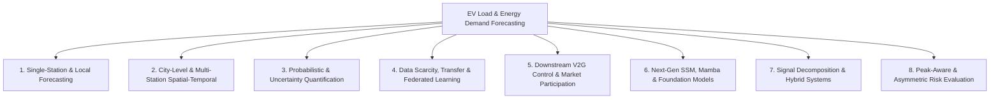

# 🔬 Master Synthesis: Literature Taxonomy & Research Gaps for Thesis

This document represents the complete, exhaustive synthesis of core findings, mathematical formulations, limitations, and open research gaps extracted across **ALL 118 research papers** (118 notes in `wiki/papers/`, totaling **531 extracted gap items**) in your Obsidian Second Brain.

> [!IMPORTANT]
> **Vault Coverage:** 100% Comprehensive (118 Papers) | **Last Updated:** 2026-09-01 | **Extraction Source:** `wiki/papers/*.md` via Automated Full-Text Analysis

---

## 🏛️ Comprehensive Literature Taxonomy (118 Papers)

---

## 📌 The 8 Major Structural Research Gap Pillars

### 1. Probabilistic & Uncertainty Quantification Gaps (P-1 to P-8)
> **Problem:** Point forecasts ($y_t \in \mathbb{R}$) fail to provide risk metrics for grid operators, while standard multi-quantile heads suffer from mathematical incoherence, quantile crossing, and distribution shifts.
- **Gap P-1: Quantile Inversion & Crossing**: Independent linear quantile heads violate monotonicity ($q_{\tau_1}(x) > q_{\tau_2}(x)$ for $\tau_1 < \tau_2$).
  - *Evidence in Corpus:* Highlighted in [[2025_Coherent_Hierarchical_EV_Load]], [[2024_Feature_Enhanced_Probabilistic_EV_Load]], [[2024_MQ_TCN_Transfer_Learning_EV]].
  - *State of Solution:* [[2025_Coherent_Hierarchical_EV_Load]] solves this via **PICNN (Partially Input Convex Neural Networks)**, but only for point-like static architectures without Mamba/Transformer sequence modeling.
- **Gap P-2: Autoregressive Accumulation & Marginal Path Independence**: Predicting joint future distributions $p(y_{t+1}, \dots, y_{t+H} | x)$ via marginal quantiles ignores temporal covariance between future steps.
  - *Evidence in Corpus:* [[2021_DeepAR_Probabilistic_Forecasting]], [[2024_DiffPLF_Conditional_Diffusion_EV]], [[2026_USDT_Dual_Direction_Probabilistic_Transformer]].
- **Gap P-3: Non-Stationary Calibration Lag under Environmental Shift**: Static conformal prediction (e.g. [[2026_TFT_Conformal_Environmental_EV_Load]]) fails when extreme weather or holiday behavioral shifts invalidate the calibration split.
- **Gap P-4: Diffusion Sampling Latency**: Diffusion-based probabilistic models (e.g. [[2024_DiffPLF_Conditional_Diffusion_EV]], [[2021_TimeGrad_Diffusion_Forecasting]]) achieve high distributional quality but require 50-100 denoising steps, making real-time microgrid dispatch infeasible.
- **Gap P-5: Extreme Peak Tail Oversmoothing**: Standard Pinball Loss $\mathcal{L}_q(y, \hat{y}) = \max(q(y - \hat{y}), (q-1)(y - \hat{y}))$ underweights low-probability, high-magnitude peak spikes.

### 2. Architectural Scalability, SSM & Post-Transformer Era (T-1 to T-8)
> **Problem:** Quadratic self-attention complexity $\mathcal{O}(N^2)$ creates computational and memory bottlenecks for long-sequence, high-resolution multivariate charging profiles.
- **Gap T-1: The $\mathcal{O}(N^2)$ Complexity Barrier**: Standard Transformers (Informer, Autoformer, PatchTST) become intractable when processing multi-week, 15-minute resolution time-series.
- **Gap T-2: Point-wise Tokenization Destroys Temporal Semantics**: Feeding raw time-series points as independent tokens ignores contiguous temporal waveforms.
  - *Evidence in Corpus:* [[2023_PatchTST_A_Time_Series_is_Worth_64_Words]], [[2023_DLinear_Are_Transformers_Effective_LTSF]].
- **Gap T-3: The Mamba Probabilistic Void (CRITICAL 2026 GAP)**: State-of-the-art State Space Models (Mamba-3, HyKANet, PC-M3) demonstrate $\mathcal{O}(N)$ linear time efficiency, but **100% of existing Mamba EV papers operate strictly as deterministic point forecasters**.
  - *Evidence in Corpus:* [[2026_Mamba_3_Sequence_Modeling]], [[2026_Mamba_KAN_HyKANet_EV]], [[2026_PC_M3_Mamba_EV_Clusters]], [[2024_TimeMachine_Mamba_Long_Term_Forecasting]].
- **Gap T-4: Heterogeneous Exogenous Cross-Attention Fusion**: Merging static metadata (station capacity), dynamic exogenous drivers (TOU tariff, temperature), and temporal load vectors inside SSMs without disrupting recurrent state dynamics.
- **Gap T-5: Inverted Variate vs Temporal Tokenization Tradeoff**: iTransformer ([[2024_iTransformer_Inverted_Transformers_Effective_Time_Series]]) inverts tokens along variates, but fails to capture localized multi-scale temporal events in single-station aggregates.

### 3. Spatial-Temporal & Dynamic Graph Migration Gaps (ST-1 to ST-6)
> **Problem:** EV charging load is inherently coupled across city networks due to traffic migration, queuing congestion, and driver routing preferences.
- **Gap ST-1: Static vs Dynamic Adjacency Matrices**: Most GCN/GAT methods ([[2022_GCN_TRN_Efficient_Transformer]], [[2024_Attention_Based_Spatiotemporal_MultiGraph]]) use static distance matrices, failing to reflect real-time traffic jams or station queue overflow.
- **Gap ST-2: Citywide Station Heterogeneity**: Urban central fast-chargers exhibit high-entropy bursty demand, while suburban residential chargers follow diurnal slow-charging patterns.
  - *Evidence in Corpus:* [[2025_Multi_Scale_Spatial_Temporal_Graph_Attention_Network]], [[2026_EVformer_Spatio_Temporal_Decoupled_Citywide]].
- **Gap ST-3: Privacy-Preserving Inter-Operator Collaboration**: Charging Network Operators (CNOs) cannot share proprietary user transaction logs due to competitive and PDPA constraints, necessitating Vertical/Horizontal Federated Learning ([[2025_Vertical_Federated_Learning_EV_Charging]], [[2025_Personalized_Federated_Learning_Household]]).

### 4. Peak-Load Underestimation & Asymmetric Risk (PK-1 to PK-4)
> **Problem:** Mean-squared error (MSE) inherently penalizes errors symmetrically, causing neural networks to predict regression toward the mean and systematically underestimate peak charging spikes.
- **Gap PK-1: Severe Transformer Peak Zone Underestimation**: Benchmark tests demonstrate that Transformer architectures suffer from **Peak Zone WAPE of 25% to 37%**, creating catastrophic transformer/feeder overload risks.
  - *Evidence in Corpus:* [[2026_Multi_scale_fusion_transformer]], [[2024_Feature_enhanced_deep_learning_probabilistic]], `transformer_research_ideas.md`.
- **Gap PK-2: Lack of Asymmetric Penalty in Objective Functions**: Standard training losses do not penalize under-prediction (which causes grid blackouts) more heavily than over-prediction.

### 5. Data Scarcity, Few-Shot Station Generalization & Cold-Start (DS-1 to DS-5)
> **Problem:** Newly commissioned charging stations have zero or only several days of historical telemetry.
- **Gap DS-1: Zero-Shot Generalization Degradation**: Time-series foundation models (Chronos-2, TimesFM, Moirai-2) degrade when transferred zero-shot to volatile single-station EV loads without task-specific fine-tuning ([[2025_Benchmarking_Time_Series_Foundation_Models]], [[2025_Chronos_2_Univariate_to_Universal]]).
- **Gap DS-2: Inductive Transfer vs Meta-Learning Adaptation**: Inductive transfer (e.g. [[2024_Location_based_Probabilistic_Load_Forecasting_MQ_TCN]]) requires similar source stations via DTW matching, whereas meta-learning (e.g. [[2023_MetaProbformer_EV_Load]], [[2026_MAML_Informer_Probabilistic_EV]]) requires computationally heavy bi-level optimization.

### 6. Downstream Grid Integration, V2G & Market Dispatch (EM-1 to EM-5)
> **Problem:** Forecasting models are evaluated purely on statistical errors (RMSE/MAE) rather than downstream operational economic value.
- **Gap EM-1: Decoupling of Statistical Accuracy and Operational Value**: A model with 5% lower RMSE can result in higher battery degradation or higher peak demand charges in real-world microgrid MPC dispatch ([[2024_A_Reliable_Evaluation_Metric_V2G_Scheduling]], [[2025_A_Stochastic_Model_Predictive_Control_Approach]]).
- **Gap EM-2: Price-Elasticity & Behavioral Feedback Loops**: Dynamic TOU pricing changes driver charging behavior, which in turn alters the load curve (endogenous feedback loop) ([[2026_TriCast_Tri_Modal_Causal_EV]], [[2024_Day_ahead_market_participation_DL]]).

---

## 📂 Comprehensive Per-Paper Limitations & Gap Registry (All 118 Papers)

| # | Paper Note | Yr | Primary Architecture | Extracted Limitations & Research Gaps |
|---|---|---|---|---|
| 1 | [[1997_Long_Short_Term_Memory]] | 1997 | `Long` | • Truncated LSTM struggles with **nondecomposable tasks** (strongly delayed XOR / parity-like problems where storing single inputs doesn't reduce error incrementally); full-gradient … • Each memory cell block costs 2 extra gate units (≤ factor-of-9 weight increase vs. standard RNN hidden unit). • Like feedforward nets seeing the whole string, CEC-based LSTM behaves similarly to a BP-trained feedforward net on the full input — problematic for e.g. 500-bit parity. *(+3 more gaps in note)* |
| 2 | [[2001_Neural_Networks_STLF_Review]] | 2001 | `Neural` | • No adequate rate between #training points and #weights has been established ("how many parameters are too many" remains open). • Comparisons to other NNs/fuzzy engines deemed invalid baselines; ARMAX/regression fitting effort discouraged fair benchmarking — a persistent evaluation gap. • Treating a day as a 24-dim vector starves training sets; multi-model and iterative approaches underexplored; chaotic behavior of iterated MLP outputs noted ([19], [20]). *(+2 more gaps in note)* |
| 3 | [[2013_Gaussian_Processes_Time_Series]] | 2013 | `Gaussian` | • Computational cost dominated by covariance-matrix inversion, scaling as $O(n^3)$ with retained samples → motivates sparse/inducing-point approximations and adaptive sample retentio… • Kernel/mean choice is subjective-looking; paper argues domain knowledge mitigates this, but automated kernel composition/search is left open. • Maximum-likelihood hyperparameter fits ignore integrand width ("potentially problematic"); full Bayesian marginalization is expensive — Bayesian quadrature itself needs tractable s… *(+2 more gaps in note)* |
| 4 | [[2014_Kingma_Adam_Optimization]] | 2014 | `Kingma` | • Theoretical regret guarantee applies only to **convex** objectives; deep-learning experiments are non-convex and purely empirical. • In CNNs the second-moment estimate becomes a poor approximation of cost-function geometry (collapses to ε-dominated values) — adaptive geometry less effective for weight-shared arc… • Adam requires learning-rate decay schedules ($\alpha/\sqrt t$) and exponentially decayed β₁ₜ for the strongest theoretical guarantees — practical training usually omits these; deca… *(+2 more gaps in note)* |
| 5 | [[2014_Scalable_Stochastic_EV_Demand]] | 2014 | `Scalable` | • Model valid only for **large populations** (rate-function assumption breaks at single-feeder/few-house scale); suitable for substations and charging stations, not individual dwelli… • No **geographical/spatial information** (grid topology, transformer limits, location-based CO₂ accounting) — explicitly deferred to future work. • Arrival statistics could not be learned from the small (620-sample) real dataset — NHTS mapping needed; NHTS entries cover only one travel day per household and cannot encode expec… *(+3 more gaps in note)* |
| 6 | [[2015_Review_AI_Load_Demand]] | 2015 | `Review` | • Backpropagation-trained ANNs suffer dependence on initial weights, slow convergence, high computational cost, local minima, and weak generalization. • Statistical/time-series methods degrade sharply under abrupt weather or calendar changes. • Identified gaps: richer meteorological inputs (humidity, wind, rainfall, body index); heuristic/evolutionary hybrid training; automated optimization of architecture and transfer fu… *(+1 more gaps in note)* |
| 7 | [[2017_Attention_Is_All_You_Need]] | 2017 | `Attention` | • Self-attention cost is quadratic $O(n^2 \cdot d)$ in sequence length; authors propose restricted neighborhood self-attention of size $r$ (path length $O(n/r)$) as future work — lat… • Attention averaging reduces effective resolution; multi-head attention is the mitigation but raises parameter/compute cost. • Generation remains sequential/auto-regressive at inference; authors list making generation less sequential and extension to image/audio/video modalities as open goals. *(+1 more gaps in note)* |
| 8 | [[2017_MAML_Model_Agnostic_Meta_Learning]] | 2017 | `MAML` | • Meta-gradient requires differentiating through the inner gradient update (second-order information); although the first-order surrogate works surprisingly well (ReLU networks are l… • On-policy RL adaptation requires fresh trajectory samples for every additional inner-loop gradient step. • Performance depends on the choice of task distribution $p(\mathcal{T})$; no mechanism proposed for task-distribution shift. *(+1 more gaps in note)* |
| 9 | [[2017_QRA_Sister_Forecasts_Probabilistic_Load]] | 2017 | `QRA` | • Linear QRA weights must be re-estimated in a rolling scheme; performance relies on calibration windows that track non-stationary forecast-error distributions. • Ex-post evaluation uses actual observed temperatures rather than operational temperature forecasts (gap shrinks only as horizon grows). • Extensions proposed by authors: apply QRA to independent expert forecasts; generate sister forecasts from other techniques ([[ANN]], [[SVM]], fuzzy regression, holiday-effect model… *(+1 more gaps in note)* |
| 10 | [[2018_Empirical_TCN_Sequence_Modeling]] | 2018 | `Empirical` | • On small corpora (word PTB, JSB Chorales), specialized heavily-tuned LSTM variants still win; authors attribute this to regularization/generative tricks orthogonal to the TCN-vs-RN… • TCNs must retain raw history up to receptive-field length during evaluation — potentially higher inference memory than an RNN's fixed hidden state. • Receptive field (k, d) is domain-dependent: transferring a short-memory configuration to a long-memory domain degrades performance — precisely the gap later addressed by adaptive-r… *(+1 more gaps in note)* |
| 11 | [[2018_Reptile_First_Order_Meta_Learning]] | 2018 | `Reptile` | • Taylor approximation valid only for small $\alpha k$; theory informal in parts (solution-manifold argument explicitly "should be taken much less seriously"). • Negative results applying Reptile to RL so far (joint training is a strong baseline there). • Large gap between training and testing error in few-shot classification; regularization unexplored. *(+2 more gaps in note)* |
| 12 | [[2019_ApplSci_EV_Load_Forecasting]] | 2019 | `ApplSci` | • Only a single charging station's limited data used; number of covered EVs is a small fraction of actual vehicle population → results cannot prove absolute superiority of any model. • Point forecasts only (no probabilistic output); no weather/spatial covariates; peak-hour errors remain large for all four models. • Authors' future work: incorporate more influencing factors and larger datasets as EV adoption grows; improve both prediction speed and accuracy; new models needed. *(+1 more gaps in note)* |
| 13 | [[2019_Deep_Probabilistic_Scheduling_Power_Markets]] | 2019 | `Deep` | • Optimal architecture is dataset-size-dependent: limited history forces shallow networks (10–20 neurons), so accuracy should grow as more data accumulates; retraining extent (how mu… • Data-driven models ignore structural/market constraints (acceptable for zonal European day-ahead clearing, but noted as future work to combine data-driven models with physically-ba… • Empirical copula suffers curse of dimensionality (mitigated only via hash/sparse storage, not vine copulas); scenario count/tractability trade-off remains. *(+1 more gaps in note)* |
| 14 | [[2019_EV_Load_Forecasting]] | 2019 | `EV` | • [[MAPE]] unusable due to zero-load periods — motivates alternative relative-error metrics for sparse EV data. • Interpolation repair (Eq. 14) only effective for minor outliers; heavy sensor error requires more specific handling. • Univariate model ignores weather, calendar, price, and spatial context; no probabilistic/interval output; fixed shallow architecture (≤4 layers, 16 nodes) not optimized systematica… *(+2 more gaps in note)* |
| 15 | [[2019_Graph_WaveNet_Spatial_Temporal_Modeling]] | 2019 | `Graph` | • Future work stated by authors: scalable methods for large-scale datasets, and learning **dynamic** (time-varying) spatial dependencies — the adaptive adjacency is static once train… • Evaluation limited to highway traffic speed; no probabilistic/uncertainty quantification (point forecasts only). • Receptive field must be artificially engineered to equal input length for one-shot multi-step output. |
| 16 | [[2019_LogSparse_Enhancing_Locality_Transformer]] | 2019 | `LogSparse` | • Training on electricity-f/traffic-f unstable with vanilla Adam — required BERTAdam workaround. • With identical input lengths, full attention still mostly outperforms sparse (except strong-long-dependency traffic-f) — sparsity trades capacity for feasibility. • Covariate-rich easy datasets (electricity-c) leave little room for locality gains. *(+2 more gaps in note)* |
| 17 | [[2020_DeepAR_Probabilistic_Forecasting]] | 2020 | `DeepAR` | • Autoregressive teacher-forcing mismatch between training and prediction (exposure bias); scheduled sampling did not help here but remains a known issue in other domains. • Scale factor choice ($\nu_i$) is a heuristic; challenging with missing data or large within-series variance. • Marginal independence across time steps in some settings; correlations only via sampled paths. *(+2 more gaps in note)* |
| 18 | [[2020_Ensemble_EV_Load]] | 2020 | `Ensemble` | • Authors explicitly note: **only limited data is used** and only **one-step-ahead forecasting** is considered; future work targets wider-range data and multi-step forecasting method… • No calendar/weather covariates beyond historical load; single-station aggregation level (all Boulder city stations pooled). • Modest gains (~1–2% RMSE over best base learner) suggest headroom via richer ensembling or probabilistic outputs. |
| 19 | [[2020_NBEATS_Interpretable_Time_Series_Forecasting]] | 2020 | `NBEATS` | • Univariate **point** forecasting only — no native probabilistic distributions/uncertainty quantification. • Generic-model basis waveforms lack inherent structure (non-interpretable); interpretability requires hand-imposed inductive bias. • No exogenous covariates supported in main experiments; meta-learning connection speculative ("should be the subject of future work"). *(+2 more gaps in note)* |
| 20 | [[2021_Autoformer_Decomposition_Transformers_AutoCorrelation]] | 2021 | `Autoformer` | • Performance degrades on data with extremely weak temporal coherence/randomness (Exchange still works, but authors note poor-predictability series degenerate all models). • Hyper-parameter $c$ trades off performance vs efficiency and needs tuning; datasets without obvious periodicity (ILI) can suffer from large $c$ (noise). • Input-length sensitivity is dataset-specific (periodic data saturates at I=96; aperiodic ILI benefits from longer inputs). *(+2 more gaps in note)* |
| 21 | [[2021_Conformal_Time_Series_Forecasting]] | 2021 | `Conformal` | • Univariate focus ($d=1$); multivariate extension left as future work. • Intervals are widest among compared models (conservative efficiency); future work targets narrower, more adaptive per-observation intervals. • Relies on exchangeability of whole-series observations; adaptation lag possible under strong non-stationarity. *(+2 more gaps in note)* |
| 22 | [[2021_CSDI_Conditional_Diffusion_Forecasting]] | 2021 | `CSDI` | • Sampling speed: iterative reverse diffusion (50 steps × network evals) slower than other generative models — authors suggest ODE solvers (DDIM etc.) for acceleration; relevant gap … • Forecasting advantage smaller than imputation advantage since benchmark forecasting datasets have few missing values and suit RNN encoders. • Historical strategy can underperform when train/test missing patterns differ. *(+2 more gaps in note)* |
| 23 | [[2021_Day_Ahead_EV_Demand]] | 2021 | `Day` | • Average-power profile construction yields discrete steps in the real aggregated demand curve that the networks cannot accurately predict. • Poor weekend forecasts due to stochastic non-commuter behavior. • Dataset private (RFID privacy) — no public benchmark reproducibility. *(+2 more gaps in note)* |
| 24 | [[2021_Hierarchical_Probabilistic_EV_Load]] | 2021 | `Hierarchical` | • Short-term focus: time-varying predictors such as number of circulating EVs or # stations excluded (limited short-term impact; relevant at medium term). • Single-model baseline per region; authors propose extending to **multi-model ensemble frameworks** in future work. • Future work: apply the hierarchical PEVLF system to optimal distribution grid operation (bi-level optimization, market participation). *(+1 more gaps in note)* |
| 25 | [[2021_Informer_Beyond_Efficient_Transformer]] | 2021 | `Informer` | • Multivariate advantage shrinks vs univariate — attributed to anisotropy of feature dimensions' prediction capacity ("beyond the scope of this paper"). • ProbSparse relies on the long-tail sparsity assumption and max-mean approximation (Lemma 1/Proposition 1 are probabilistic, not exact). • Dynamic decoding baselines (Reformer) perform poorly in LSTF — architecture choice (generative decoder) matters more than attention alone. *(+1 more gaps in note)* |
| 26 | [[2021_Probabilistic_Queuing_EV_Load]] | 2021 | `Probabilistic` | • Charging load validated on a **simulated FCS** driven by real TF — no measured charging-session data; queuing parameters ($\sigma$, $\delta$, $\varsigma$) assumed rather than empir… • Single-station scope (one motorway segment); no spatial generalization across networks. • Driver behavior modeled via stylized exponential/logarithmic heuristics; no price-responsive or dynamic behavioral adaptation. *(+2 more gaps in note)* |
| 27 | [[2021_RL_Q_Learning_EV_Load]] | 2021 | `RL` | • **Entirely synthetic evaluation**: loads generated from stylized parametric PDFs; no empirical validation against measured charging-station sessions, no confidence intervals or sta… • Action space limited to selecting between only two base models (ANN/RNN) — no richer ensemble, no continuous blending weight, no modern sequence models (LSTM/GRU/TFT variants) as c… • Reward requires ground truth during learning — formulation is closer to adaptive model weighting than true online forecasting without labels. *(+3 more gaps in note)* |
| 28 | [[2021_TFT_Temporal_Fusion_Transformers]] | 2021 | `TFT` | • Single interpretable attention layer only; quadratic attention cost limits very long look-back windows. • Iterative baselines required imputation of unknown future inputs (last-value carry-forward), an artificial handicap whose realism varies by application. • Static enrichment assumes informative metadata; datasets lacking rich static covariates (Electricity/Traffic use only entity ID) limit that pathway's evaluation. *(+2 more gaps in note)* |
| 29 | [[2021_TimeGrad_Diffusion_Forecasting]] | 2021 | `TimeGrad` | • **Inference latency**: sampling loops $N=100$ times over $\epsilon_\theta$ per autoregressive timestep × $S=100$ trajectory samples — costly for large-scale or near-real-time EV fo… • RNN conditioning limits very long sequences — authors propose Transformer encoders as replacement conditioning backbone. • No explicit modeling of discrete distributions (flows need dequantization; EBMs do not — left as future work). *(+3 more gaps in note)* |
| 30 | [[2022_GCN_TRN_EV_Availability]] | 2022 | `GCN` | • Very small dataset: single city, ~15 days, 23 stations, 2746 sessions — limited generalization evidence; no train/test split details or hyperparameters reported. • Only availability magnitude $p_n$ modeled; no exogenous features (weather, POI/events mentioned qualitatively as factors but not included). • Short horizons only (≤90 min); "long-term" claim modest relative to day-ahead needs. *(+2 more gaps in note)* |
| 31 | [[2022_RevIN_Reversible_Instance_Normalization]] | 2022 | `RevIN` | • Purely point forecasts — no uncertainty quantification; no EV-specific evaluation despite direct relevance (EV charging load is strongly non-stationary across station lifecycle). • Assumes future window statistics ≈ input-window statistics plus a small offset (Eq. 9 assumption) — may fail under abrupt regime changes longer than the input window. • Evaluated mostly on generic benchmarks; no spatio-temporal modeling (each variable treated independently). *(+1 more gaps in note)* |
| 32 | [[2022_Robust_Deep_Gaussian_Process_Load]] | 2022 | `Robust` | • Gaussian posterior assumption per layer partially relaxed only by sampling; still GP-based (kernel stationarity assumptions). • Demonstrated on aggregate zonal/city load, not EV charging stations; authors state future work targets other low-data power-system applications. • Mobility features are pandemic-specific proxies — analog for EV would be e.g. traffic/events data for new or disrupted charging stations. *(+1 more gaps in note)* |
| 33 | [[2023_Combined_Deep_Learning_EV_Station_STLF]] | 2023 | `Combined` | • Authors' own limitation: "**only limited data is used**" — single charging station, single year (2020), three-day test set; they plan to explore wider data and additional influenci… • No exogenous variables (weather, temperature, holidays, tariff/price, point-of-interest) despite citing SVR work that used them. • No comparison against classical ML baselines (SVR, PSO-SVM) or recent hybrid models; no statistical significance testing. *(+3 more gaps in note)* |
| 34 | [[2023_Crossformer_Cross_Dimension_Dependency]] | 2023 | `Crossformer` | • Router builds full all-to-all dimension connections → introduces noise on high-dimensional datasets; sparse graph-transformer structures suggested as future improvement. • Permutation-invariance critique of DLinear acknowledged: Crossformer is outperformed by DLinear on several datasets (ETTm1 long horizons, ECL, Traffic); enhancing order preservatio… • Straightforward covariate embedding does not improve accuracy — incorporating covariates remains an open problem. *(+1 more gaps in note)* |
| 35 | [[2023_DiffSTG_Probabilistic_ST_Graph_Diffusion]] | 2023 | `DiffSTG` | • Explicitly acknowledged: DiffSTG still trails state-of-the-art **deterministic** STGNNs (e.g., GMSDR, STGNCDE) because its variational-inference objective yields an inaccurate post… • Only vanilla GCN used in UGnet for simplicity; incorporating more powerful GNNs to better capture ST dependencies is open. • Future direction: applying DiffSTG to other spatio-temporal tasks such as STG imputation. *(+1 more gaps in note)* |
| 36 | [[2023_DLinear_Are_Transformers_Effective_LTSF]] | 2023 | `DLinear` | • One-layer linear models have limited capacity: they cannot capture temporal dynamics caused by change points; authors position LTSF-Linear as a baseline, not an end model. • No cross-variate correlation modeling (weights shared across variates). • Findings are specific to existing LTSF benchmarks; authors call for revisiting Transformer validity in other tasks (anomaly detection) and for new model designs, data processing, a… *(+1 more gaps in note)* |
| 37 | [[2023_MetaProbformer_EV_Load]] | 2023 | `MetaProbformer` | • **Univariate only** — weather/traffic covariates missing from public datasets; multivariate extension left open. • Requires *some* historical data: fails on brand-new stations with zero history — authors propose **zero-shot** generalization across heterogeneous station record systems as future … • Gaussian output assumption may underfit heavy-tailed/multimodal EV load distributions (vs quantile or diffusion models). *(+2 more gaps in note)* |
| 38 | [[2023_Multi_Branch_ResTrans_Solar]] | 2023 | `Multi` | • Accuracy degrades as distance between sites grows — spatial graph construction / distance-aware attention not addressed. • Deterministic point forecasts only; no probabilistic uncertainty bands (important for grid integration). • Fixed sliding window (24 steps, half-day); horizon sensitivity not systematically ablated. *(+2 more gaps in note)* |
| 39 | [[2023_NHiTS_Neural_Hierarchical_Interpolation]] | 2023 | `NHiTS` | • Strictly **univariate** (each variable predicted from own history) — cannot exploit cross-variable dependencies common in EV station networks; authors flag multivariate integration… • Point forecasts only (MAE loss) — no probabilistic/quantile outputs for downstream uncertainty-aware decisions. • Interpolation smoothness assumption may limit abrupt regime shifts (e.g., anomalous events, new-station cold start). *(+2 more gaps in note)* |
| 40 | [[2023_PatchTST_A_Time_Series_is_Worth_64_Words]] | 2023 | `PatchTST` | • Channel-independence ignores explicit cross-channel correlations; authors state modeling cross-channel dependencies properly is an important future step (suggest GNN-based extensio… • No probabilistic/uncertainty quantification (point forecasts, MSE only). • Exchange-rate-type financial series excluded due to weak predictability — generalization claims limited to physical/engineering signals. |
| 41 | [[2023_TimesNet_Temporal_2D_Variation_Modeling]] | 2023 | `TimesNet` | • Point forecasts only; no probabilistic/uncertainty modeling for forecasting. • Performance sensitive to top-k frequency count in low-level tasks (forecasting/anomaly detection); robust for high-level tasks. • Authors' stated future work: large-scale pre-training methods using TimesNet as general-purpose time-series backbone. *(+1 more gaps in note)* |
| 42 | [[2023_Transformer_EV_Demand]] | 2023 | `Transformer` | • Daily aggregation only — cannot forecast sub-hourly steps (15 min, 1 h); authors recommend larger datasets with finer resolution (e.g., residential charging). • Small sample size (1,425 points) limits deep model training. • No traffic distribution features despite their influence on charging behavior; suggested for future work. *(+1 more gaps in note)* |
| 43 | [[2023_Treatment_Effects_Continuous_Time_Hidden_Confounders]] | 2023 | `Treatment` | • Evaluation is one-step-ahead estimation; long-horizon counterfactual rollout is not addressed. • Hidden-confounder recovery relies on frequency-domain filtering + Lipschitz bounding heuristics; identifiability of the latent factor model is not formally proven. • Synthetic experiments are small-scale; only two real-world datasets (both clinical/epidemiological), no public-benchmark treatment-effect suites. *(+2 more gaps in note)* |
| 44 | [[2023_VMD_Prophet_LSTM]] | 2023 | `VMD` | • Only univariate historical load; no explicit integration of external drivers (electricity prices, temperature, weather) into Prophet/LSTM inputs. • Single-station case study; no spatial/multi-station or transfer evaluation; no probabilistic/uncertainty quantification. • Fixed zero-crossing threshold (0.05) heuristic; k-selection via energy-jump rule is empirical. *(+2 more gaps in note)* |
| 45 | [[2024_Adaptive_Probabilistic_Netload]] | 2024 | `Adaptive` | • Adaptation of **multivariate probabilistic forecasts** (joint dependency structures) unexplored — how to adapt marginals and dependency structures simultaneously has not been studi… • Only **non-extreme quantiles** considered; adaptive estimation of extremes (e.g., replacing the generalized-Pareto tail modeling of Browell & Fasiolo) is open and challenging. • Gaussian Kalman posterior alone poorly calibrated (fixed variance assumption violated) — motivates nonparametric residual quantile correction. *(+2 more gaps in note)* |
| 46 | [[2024_Attention_Spatiotemporal_MultiGraph_EV_Load]] | 2024 | `Attention` | • Model assumes location correlations exist in historical load series; cannot capture dependencies between distant stations whose loads are uncorrelated. • Robustness to missing/incorrect values (common in charging datasets) not addressed — flagged as future work. • Hyperparameters manually tuned; small network scale (10 stations); no probabilistic/uncertainty output. *(+1 more gaps in note)* |
| 47 | [[2024_Autoformer_EV_Charging]] | 2024 | `Autoformer` | • Data aggregated **daily and across all 51 stations** — masks station-level and sub-daily fluctuations; no spatial dimension. • Only one baseline ([[LSTM]]); no other Transformer variants or statistical baselines evaluated. • High MAPE (~35%) even for Autoformer reflects difficulty of long-term EV demand prediction with limited features. *(+1 more gaps in note)* |
| 48 | [[2024_BiMamba_Bidirectional_Mamba_Forecasting]] | 2024 | `BiMamba` | • Strategy switch threshold λ can change decisions near boundaries (e.g., ts flips between λ=0.6 and λ=0.8 on ETTh2/ETTm2), though impact is small when many highly correlated variabl… • Patch-wise tokens retain mostly local information with less global information compared to whole-sequence tokens (mitigated but inherent trade-off). • Evaluated only on generic LTSF benchmarks; future work targets more diverse/complex scenarios such as network flow forecasting — EV charging load is an untested application domain. *(+1 more gaps in note)* |
| 49 | [[2024_Conformal_Prediction_DER]] | 2024 | `Conformal` | • Assumes a **fixed two-level hierarchy with linear (summation) aggregation**; deeper hierarchies (pole–circuit–substation–region) and nonlinear aggregations (e.g., sigmoid voltage-s… • Primarily suited to short-to-medium horizon forecasts; data-driven nature cannot anticipate events absent from history (e.g., future DER policy shifts) — long-horizon planning rema… • Requires known, static topology C; restrictive for dynamic/unknown networks (healthcare, economics, social analysis). *(+1 more gaps in note)* |
| 50 | [[2024_Data_Driven_EVCS_Demand_Forecasting]] | 2024 | `Data` | • Only **univariate autoregressive** inputs ($H_t$, past 24 h): no calendar, weather, TOU price, or traffic features (contrast [[2024_TOU_Price_Meteorology_EV_Charging_Load]] which a… • One-step (1 h ahead) only; no multi-step or day-ahead horizons. • Two workplace stations only (same ACN source); no cross-station/cross-region generalization testing. *(+2 more gaps in note)* |
| 51 | [[2024_Day_Ahead_EVCB_EVSC_Parking_Lot]] | 2024 | `Day` | • Only slow-charging EVs modeled; fast-charging loads treated as uncontrollable. • Real-time scheduling strategy impact on EVSC calculation not analyzed — flagged as future work. • Further research planned on EVSC mining across different scenarios/EV clusters in EVPLs. *(+1 more gaps in note)* |
| 52 | [[2024_DiffPLF_Conditional_Diffusion_EV]] | 2024 | `DiffPLF` | • Requires a separate task-informed fine-tuning stage for accuracy — authors target a more efficient **end-to-end diffusion model** specialized for probabilistic load forecasting. • Performance sensitive to diffusion steps T; principled selection of T per scenario left as future work. • Univariate/station-level scope; extension to **multivariate diffusion** generative models for EV charging and general energy time-series is future work. *(+1 more gaps in note)* |
| 53 | [[2024_Divide_Conquer_Transformer_EV]] | 2024 | `Divide` | • Performance degrades substantially with longer predictive spans (1–60 min much weaker than 1–10 min); far-future minute-level event prediction remains hard. • Supervised labels derived from a fixed >3 kW heuristic; requires EV-charging-aligned ground truth during training even though inference needs only meter data. • Single-dataset (Austin, TX) evaluation; no cross-region generalization or transfer learning tests. *(+1 more gaps in note)* |
| 54 | [[2024_EV_Load_Forecasting_DAM]] | 2024 | `EV` | • No probabilistic/quantile forecasts — point forecasts only, though DAM bidding and risk management need uncertainty quantification. • Best improvements over persistence are modest (<2%); no model dominates across datasets → no one-size-fits-all approach; performance tied to fleet characteristics (location, size, … • Bid price strategy explicitly out of scope (quantity-only bidding). *(+2 more gaps in note)* |
| 55 | [[2024_Feature_Enhanced_Probabilistic_EV_Load]] | 2024 | `Feature` | • Single-station focus — authors flag extension to **spatio-temporal multi-station forecasting** as future work. • Assumes future values of exogenous features (price, weather, temperature) are reliably known. • Linear (Pearson-only) prior may miss nonlinear feature-demand relations; threshold |r| ≥ 0.1 is heuristic. *(+3 more gaps in note)* |
| 56 | [[2024_Forwardformer_Day_Ahead_Load]] | 2024 | `Forwardformer` | • Hyperparameters chosen by grid search balancing accuracy vs runtime, not guaranteed globally optimal (e.g., N=6 might be slightly more accurate than N=4 but too slow). • MSFSA efficiency relies on a custom CUDA/TVM kernel requiring low-level GPU programming knowledge. • Future work stated by authors: day-ahead **load peak forecasting under special events**; transferring MSFSA to wind power and photovoltaic forecasting with targeted improvements. *(+2 more gaps in note)* |
| 57 | [[2024_iTransformer_Inverted_Transformers_Effective_Time_Series]] | 2024 | `iTransformer` | • Quadratic complexity O(N²) in number of variates for high-dimensional datasets; mitigated by efficient attentions or variate sampling but not solved natively. • Under univariate scenarios iTransformer degrades into a stackable linear forecaster; temporal dependency modeling could be further enhanced (structural TCN-like embeddings suggeste… • Distribution shift handling left to layer norm; explicit non-stationarity modules remain future work. *(+2 more gaps in note)* |
| 58 | [[2024_KAN_Kolmogorov_Arnold_Networks]] | 2024 | `KAN` | • **Slow training**: KANs are typically **10× slower than MLPs** for the same parameter count (no batch computation across distinct activations); authors deem it an engineering probl… • No generalized "deep" Kolmogorov-Arnold theorem exists; mathematical understanding of deeper KANs and dimension-dependence of constant $C$ left as future work. • Results demonstrated only on **small-scale AI + Science tasks**; unclear whether fast scaling holds for large tasks (e.g., language modeling). *(+2 more gaps in note)* |
| 59 | [[2024_LASSO_BPNN_Mid_Term_EV_Load]] | 2024 | `LASSO` | • Very short history (13 monthly points; 12 for Residential) → severe sample-size constraint motivating LASSO regularization but limiting deep-learning alternatives; authors acknowle… • Monthly granularity only; authors' stated future work: extend to **shorter periods** and apply to grid scheduling and charging-station siting optimization. • Table III presentation defects make exact quantitative comparison non-reproducible from text alone. *(+2 more gaps in note)* |
| 60 | [[2024_LSTM_Transformer_EV_Consumption]] | 2024 | `LSTM` | • Small, single-region dataset (10 vehicles, China); authors explicitly call for validation on broader datasets under diverse geographic/climatic conditions. • Battery state-of-health ([[SOH]]) not modeled — future work for extended-range prediction. • Feature engineering limited to powertrain subsystems; other vehicle subsystem data unexploited. *(+2 more gaps in note)* |
| 61 | [[2024_MQ_TCN_Transfer_Learning_EV]] | 2024 | `MQ` | • Authors: model "failed in some novel situations" under transfer — future work on continual representation learning and adding meta-information. • No conclusive guidance on lookback/horizon choice; sensitivity is site-specific. • High NREL Winkler Scores despite high PICP indicate wide intervals (over-coverage without sharpness guarantees). *(+2 more gaps in note)* |
| 62 | [[2024_Physics_Informed_GAT_EV_Load]] | 2024 | `Physics` | • Focus limited to the demand–price relationship; many other misinterpretations exist in spatiotemporal deep models and remain unaddressed. • Pre-training must be carefully monitored ("model curing" / overfitting to tuning samples); authors suggest an automated critique module trained by Reinforcement Learning as future … • Spillover effects are detected but not quantified; quantification would help regulators evaluate policy impacts. |
| 63 | [[2024_PowerMamba_Power_Systems_SSM]] | 2024 | `PowerMamba` | • **Point forecasts only** — trained with L2 loss, evaluated with MSE/MAE; no probabilistic/quantile output (contrast with [[Pinball_Loss]]-style methods relevant to EV charging). • **Zonal granularity, not station/nodal level** — authors position DSO-level adaptation as future work; nothing about EV charging stations or EV-specific load evaluation (EVs appear… • External forecasts unavailable for price/AS series; robustness tested only against synthetic iid Gaussian forecast noise. *(+2 more gaps in note)* |
| 64 | [[2024_Prediction_Interval_EV_Loads]] | 2024 | `Prediction` | • Single feeder, hourly resolution, ~2-month test window — generalization to other feeders/geographies/resolutions untested. • EV charging loads for only 30 vehicles, synthetically sampled from a statistical (KDE/Gamma/log-normal/uniform) model rather than directly measured per-EV metering. • GPR scales poorly to large training sets (kernel-matrix inversion); authors do not discuss computational cost or sparse/variational GP variants. *(+3 more gaps in note)* |
| 65 | [[2024_Robust_MTS_Transitional_Shift]] | 2024 | `Robust` | • Authors' stated future work: exploring time-variant dynamics on **higher-dimensional MTS data** and further improving **efficiency**. • Slightly inferior MAE vs. MSE-only-trained baselines due to dual reconstruction+prediction MSE losses (bias of objective function). • Sensitive to trade-off parameter α (violent fluctuation when α < 0.6); requires tuning. *(+3 more gaps in note)* |
| 66 | [[2024_TiDE_Long_Term_Forecasting]] | 2024 | `TiDE` | • Self attention may still be unnecessary only for these long-term benchmarks; rigorous analysis of MLPs/Transformers under models with varying seasonality/trend levels remains open. • Transformers are more parameter-efficient than MLPs despite higher memory/compute intensity — a limitation for extremely large-scale pre-trained forecasting models. • Point forecasts with MSE loss only; no probabilistic outputs; no EV-specific evaluation (Electricity/Traffic are proxy domains). |
| 67 | [[2024_TimeMachine_Mamba_Long_Term_Forecasting]] | 2024 | `TimeMachine` | • Ranks second on Weather dataset at small prediction lengths — an area for future improvement. • Qualitative alignment with ground truth could still be enhanced (Figure 3). • Future work: extending TimeMachine to self-supervised learning settings. *(+1 more gaps in note)* |
| 68 | [[2024_TimesFM_Decoder_Only_Foundation_Model]] | 2024 | `TimesFM` | • **Probabilistic forecasting not evaluated**: Only point MSE loss; quantile heads / distribution NLL discussed (§4 Loss, A.1) but left to future work/finetuning. No CRPS/Winkler/PIC… • **No covariates**: Model is univariate-only at pretraining; multivariate / exogenous handling (weather, price, traffic) unsolved — paper proposes residual regression or finetuning … • **Granularity imbalance**: Performance relies on synthetic data to cover rare granularities (quarterly/yearly/weekly); real data dominated by hourly/daily. Monthly/weekly max conte… *(+6 more gaps in note)* |
| 69 | [[2024_TOU_Price_Meteorology_EV_Charging_Load]] | 2024 | `TOU` | • Single station, ~1 year of hourly data; very small training set (first 18 days) — generalization untested; no cross-station validation. • Authors' own future work: explore impact of **additional external factors** on load forecasting to improve applicability and accuracy. • Only point forecasts; no probabilistic/uncertainty quantification. *(+2 more gaps in note)* |
| 70 | [[2024_Unified_Training_Universal_Time_Series_Transformers]] | 2024 | `Unified` | • 1. **Heuristic Frequency-to-Patch Mapping**: The mapping from sampling frequency to allowed patch sizes is fixed heuristically ($8 \dots 128$) rather than dynamically learned or co… |
| 71 | [[2024_V2G_SVE_Evaluation_Metric]] | 2024 | `V2G` | • V2G-SVE reliability presupposes actual EV charging behavior follows the predefined statistical features; impractical when few EVs or statistically irregular behavior. • Metric tied to the load-variance-minimization objective; may not transfer to other V2G scheduling objectives (different stakeholders/objectives need re-derived value metrics). • Non-uniformity: metric built on aggregate model while ground-truth performance solved directly per-EV; conventional solvers hit resource limits at scale. *(+1 more gaps in note)* |
| 72 | [[2025_Benchmark_Foundation_Models]] | 2025 | `Benchmark` | • Possible cross-domain temporal information leakage: TSFMs pre-trained on data covering the same calendar period may encode global patterns (Covid-19, geopolitical crises); only sol… • No hyperparameter tuning of TFS baselines (compute constraints) could understate their performance. • Restricted input sizes (max 168 h) disadvantage architecture-dependent models (LagLlama's lags, Moirai's context 1000); longer contexts unexplored. *(+2 more gaps in note)* |
| 73 | [[2025_BWO_ICEEMDAN_iTransformer]] | 2025 | `BWO` | • Model fusion (decomposition + optimization + deep forecaster) adds computational burden at training time; acceptable but must be managed for real-time operation. • Single-country dataset (Singapore), system-level load only — no EV-station or spatio-temporal evaluation; no probabilistic/uncertainty quantification. • Deterministic point forecasts only; decomposition performed per-split requires care against information leakage in operational deployment. |
| 74 | [[2025_CAT_Former_Short_Term_EV]] | 2025 | `CAT` | • Only 3 stations of one mid-size US city; authors note future work should add other cities and external factors like road traffic/networks. • No probabilistic outputs; deterministic point forecast only (MSE loss). • Daily aggregation discards hourly structure for the 1-day task; seasonality deliberately not preserved in the split. *(+3 more gaps in note)* |
| 75 | [[2025_Chronos_2_Univariate_to_Universal]] | 2025 | `Chronos` | • **Covariate scope**: Only numeric + categorical covariates; **multimodal (e.g. text) covariates** not supported — noted as promising future direction (Zhang et al. 2025). • **ICL limited on multivariate**: Gains smallest on multivariate subset; suggests current multivariate leverage may not yet exploit cross-variate structure as effectively as covaria… • **No EV-specific evaluation**: Benchmarks are general time-series; performance on **EV charging load** with its specific covariates (ToU price, weather, SoC, arrival/departure) not… *(+3 more gaps in note)* |
| 76 | [[2025_Coherent_Hierarchical_EV_Load]] | 2025 | `Coherent` | • Only a flat two-level hierarchy (3 stations + total) tested; authors state future work on more complicated hierarchical structures (grouped/nested trees). • Reconciliation applied to sampled scenarios rather than full predictive distributions (linear constraints on random variables induce intractable convolutions of CDFs/PDFs). • Probabilistic quality degrades at high quantile levels (skewed demand); forecast accuracy declines with longer horizons. *(+1 more gaps in note)* |
| 77 | [[2025_DC_Charging_Profiles_TFT]] | 2025 | `DC` | • Proprietary NDA-restricted dataset limits external replication; generalization beyond northwestern Europe / other climates may need new training data or transfer learning. • 60-s charger logging interval and OCPP integer SoC precision bound effective temporal resolution; updates become sparse late in sessions. • No cross-session user modelling/personalization (privacy constraints); future work suggests differential privacy or federated learning for user-level modelling. *(+1 more gaps in note)* |
| 78 | [[2025_EV_STLLM_Spatio_Temporal_LLM]] | 2025 | `EV` | • Framework is heavy (LLM-based); authors propose **knowledge distillation** to build lighter-weight models suitable for localized deployment at individual stations. • Predictions not yet coupled to downstream action — future work should integrate forecasts with scheduling strategies for electricity-market transactions of charging stations/EV agg… • Only two randomly selected zones evaluated; generalization across many zones/cities untested. Prompt-free topology injection relies on proximity-based adjacency only (no semantic/r… |
| 79 | [[2025_Hybrid_LSTM_Transformer_Demand]] | 2025 | `Hybrid` | • Higher model complexity → longer training time; restrictive for real-time/resource-limited deployment. • Univariate, history-only inputs — no weather, traffic patterns, or user-behavior covariates; multimodal integration proposed as future work. • No short-term evaluation (1 h / 24 h / 7 days ahead) though architecture permits it. *(+2 more gaps in note)* |
| 80 | [[2025_LTLM_LSTM_EV_Load]] | 2025 | `LTLM` | • Peak underestimation/flattening due to long-period averaging — a core accuracy deficit for capacity-planning use cases. • Single-station, partially synthetic, extrapolated dataset (~6 months real stretched to 1000 days) — weak evidence base for genuine multi-year LTLF claims. • No quantitative benchmarking against baselines (ARIMA, GRU, SVR, Transformer), no reported error metrics, and no ablations. *(+2 more gaps in note)* |
| 81 | [[2025_Meta_Learning_Physics_Informed_GACN_Power_System]] | 2025 | `Meta` | • Evaluation purely on simulation-generated data (MATPOWER power flow); no real SCADA/D-PMU field measurements. • Fine-tuning still requires gradient updates and labeled samples from each new topology; zero-shot adaptation not addressed. • Single-snapshot state estimation; temporal dynamics/unrolled spatio-temporal extensions left implicit. *(+2 more gaps in note)* |
| 82 | [[2025_MixerInformer_Transfer_Learning_New_EV_Stations]] | 2025 | `MixerInformer` | • Relies mainly on station-specific historical data; external variables (weather, traffic patterns, socio-economic factors) not modeled. • Robustness in highly heterogeneous or rapidly evolving environments (drastically different usage profiles) unverified. • Computational efficiency still a challenge for real-time deployment on resource-constrained systems despite ProbSparse attention. *(+2 more gaps in note)* |
| 83 | [[2025_MSSTGAN_City_EV_Load]] | 2025 | `MSSTGAN` | • Authors explicitly acknowledge insufficient explanation of cross-dataset performance variation (esp. Boulder vs ST-GAT). • No exogenous covariates used — future work plans integration of **weather conditions and traffic flow**. • Computational efficiency optimization targeted for future real-time deployment. *(+2 more gaps in note)* |
| 84 | [[2025_Multi_View_Graph_Intrusion_Detection_EV]] | 2025 | `Multi` | • Performance highly sensitive to hyperparameter tuning (lr, augmentation rate); augmentations must be manually designed to align pretext tasks with downstream objectives. • Future work: adaptive graph-augmentation methods tailored automatically to tasks; theoretical grounding of multi-view contrastive objectives. • Broader applications proposed: anomaly detection/demand-response support in integrated power-transportation networks, soft-open-point scheduling with energy storage. *(+1 more gaps in note)* |
| 85 | [[2025_Personalized_Federated_Learning]] | 2025 | `Personalized` | • Requires appliance-level sub-metering; future work integrates [[NILM]] disaggregation to enable sensor-free deployment. • 1-min resampling too coarse for short-duration appliances (microwave/kettle) — limited accuracy gains there. • Planned systematic comparison of household-level vs appliance-level prediction trade-offs. *(+1 more gaps in note)* |
| 86 | [[2025_QR_LSTM_Attention_EV_Load]] | 2025 | `QR` | • Only three discrete quantile models rather than a full predictive distribution; quantile crossing not discussed. • Single site (one parking lot), single dataset; generalization to other station types untested. • Authors' stated future work: include **additional input lags** and **extend the forecasting horizon** beyond 24 h. *(+2 more gaps in note)* |
| 87 | [[2025_ResMMoT_Informer_Time_Series]] | 2025 | `ResMMoT` | • The multi-expert structure of ResMMoT introduces **parameter redundancy** — future work targets parameter sharing and module compression for lighter deployment. • Currently univariate price-based; authors plan to add multimodal exogenous context (macroeconomic indicators, social-media sentiment). • Financial-domain validation only; no energy/EV experiments (transferable architecture for volatile multi-resolution load/price forecasting remains untested). *(+1 more gaps in note)* |
| 88 | [[2025_REST_Network_Port_EV]] | 2025 | `REST` | • Future work: incorporate real-time sensor feedback streams, external energy-market signals, adaptive learning mechanisms; scale to smart-city ecosystems and decentralized energy sy… • Dataset is a single-location Kaggle set for port logistics fleets (not public charging stations); key result tables only available as images, limiting reproducibility of baseline c… |
| 89 | [[2025_Stochastic_MPC_Conformal_Hub]] | 2025 | `Stochastic` | • **Static EnbPI calibration is not adaptive/covariate-aware**: price coverage collapses to 0.60 (0.22 in Autumn) under the 2021 regime change — motivates online/weighted conformal r… • **Simulation only**: closed-loop simulated environment, no hardware/real-time deployment; authors suggest future work on jointly optimizing charging power levels and schedules of i… • **Independence assumption between variables** when building the scenario tree (Pev × Ppv × pel cross-correlations ignored); equal scenario probabilities ρs = 1/Ns rather than learn… *(+1 more gaps in note)* |
| 90 | [[2025_Stochastic_MPC_Microgrid_EV]] | 2025 | `Stochastic` | • Only EV-related uncertainties are modeled stochastically; WT/PV/baseload/price forecasts treated as given (authors' future work: "more uncertain elements in the microgrid"). • Computational burden still exceeds RBC/D-MPC due to multiscenario sampling. • No real-world/hardware validation; simulation only, single-day case study, 100-EV fleet. *(+1 more gaps in note)* |
| 91 | [[2025_Sundial_Highly_Capable_Time_Series_Foundation_Models]] | 2025 | `Sundial` | • **Univariate-only pre-training** (S3 format, per-variable normalization): No explicit cross-variate / covariate modeling; multivariate dependencies and exogenous covariates (arriva… • **Very high-frequency data not guaranteed**: TimeBench dominated by middle/low frequencies (ERA5 daily etc.); performance on tick/10s-level series untested — multi-scale generaliza… • **Naïve sampling**: Starts from $\mathcal{N}(0,I)$ with uniform $K=50$ Euler steps; frequency normalization / advanced samplers and post-processing unexplored. *(+4 more gaps in note)* |
| 92 | [[2025_TiRex_Zero_Shot_Forecasting_In_Context_Learning]] | 2025 | `TiRex` | • 1. **Univariate Formulation Only**: TiRex processes multivariate time series via channel-independence (independent univariate sequences), ignoring inter-variate cross-series correl… |
| 93 | [[2025_Transformer_BiLSTM_Price_Forecasting]] | 2025 | `Transformer` | • Degrades on extreme price spikes/outliers (February/July spikes, prices > $200/MWh systematically underestimated) — no explicit spike-handling mechanism. • Univariate design ignores load forecasts, weather, generation mix/renewables, and other market covariates that could improve accuracy in volatile periods. • Highest training time of the compared models; computational cost needs optimization. *(+1 more gaps in note)* |
| 94 | [[2025_Vertical_Federated_EGAT_LSTM]] | 2025 | `Vertical` | • Collaborative cloud assumed semi-honest ("not purely malicious"); malicious-cloud inference not covered — future work on data decomposition and multi-cloud collaborative training. • Encrypted offline training still ~10× slower than local training (homomorphic overhead); online stage avoids encryption. • Only simulated dispatch-generated data (no real charging-session records); single-station target per case. |
| 95 | [[2026_CNN_LSTM_Attention_Fast_Charging]] | 2026 | `CNN` | • Both models underestimate rare, abrupt high-magnitude charging spikes (irregular events underrepresented in training data). • Single-station evaluation only; no cross-network generalization tested. Future work: transfer learning / low-rank adaptation (LoRA-style) to multiple fast-charging networks, online… • Maintaining two separate models per horizon adds deployment cost; a mixture-of-experts unification proposed as future direction. *(+1 more gaps in note)* |
| 96 | [[2026_Decomposition_Stacked_Meta_Learning_EV_Load]] | 2026 | `Decomposition` | • Relies only on load-intrinsic features; **no exogenous variables** (temperature, precipitation) yet — weather-aware features are planned future work. • No probabilistic/uncertainty-quantified forecasts (deterministic point predictions only); probabilistic extension planned. • No adaptive online learning mechanism for evolving charging environments; scalability/real-time adaptation left open. *(+1 more gaps in note)* |
| 97 | [[2026_DualDirection_Transformer_EV_Charging]] | 2026 | `DualDirection` | • **Short-horizon accuracy:** advantage concentrated at long horizons; short-term gains over strong baselines are modest (inductive biases favor low-frequency components/cross-statio… • **Computational complexity:** +213% iteration latency from multi-scale pathways, dual-direction interactions and test-time adaptation; pruning, knowledge distillation, low-rank fac… • **Domain shift:** absolute accuracy degrades under pronounced distributional discrepancies (temporal coverage, station configuration, regional usage patterns); domain adaptation / … *(+2 more gaps in note)* |
| 98 | [[2026_EnergyMamba_Graph_Mamba_ASCQR]] | 2026 | `EnergyMamba` | • **Domain granularity**: regional/building-aggregate energy consumption (CBGs, ISO zones) — NOT EV-charging-station-level forecasting; no plug-in/session dynamics, no SOC or user be… • Authors' own limitation (Sec. 8): graph edges are geographic-proximity proxies; physical grid topology is not modeled (future work: true topology + adaptive graph learning). • No monotonicity/exogeneity guarantees à la [[PICNN]]: intervals come from quantile heads + post-hoc conformal wrapper, so there is no structural constraint linking covariates to in… *(+2 more gaps in note)* |
| 99 | [[2026_EVformer_Spatio_Temporal_Decoupled_Citywide]] | 2026 | `EVformer` | • Dataset covers only ~1 month (single season, summer Shenzhen); authors state reaching ~1% RMSE would require **longer-term, multi-season datasets**, **exogenous variables (weather … • Future work: incorporate external data sources (weather, traffic flow); develop lighter-weight models for real-time scheduling and edge computing; extend evaluation to seasonal eff… • Evaluation limited to very short horizons (≤45 min) with 247 aggregated region nodes rather than individual stations; no probabilistic/uncertainty quantification; GMAN appears in e… |
| 100 | [[2026_FlowState_Sampling_Rate_Equivariant_Forecasting]] | 2026 | `FlowState` | • 1. **Polynomial Truncation Error**: Truncating Legendre polynomials to $K$ basis terms limits extremely high-frequency oscillation representation beyond degree $K$. 2. **Channel-In… |
| 101 | [[2026_Hybrid_XGBoost_BiLSTM_EV_Load]] | 2025 | `Hybrid` | • Single real site (ACN-Caltech) training limits geographic/operational generalization — demonstrated by weak zero-shot cross-site transfer (R² ≈ 0.01); domain adaptation or retraini… • Heavy reliance on accurate charging-duration data, which may be unavailable for long-horizon forecasts; temporal features are overshadowed, so time-of-use/grid-event-driven variati… • High walk-forward CV (0.51) indicates sensitivity to temporal drift → periodic (e.g., monthly) retraining advised. *(+1 more gaps in note)* |
| 102 | [[2026_INLA_Spatio_Temporal_EV_Demand]] | 2026 | `INLA` | • **Session counts, not kWh load or peak power** — energy/power modelling flagged as future work needing heavier-tailed likelihoods. • Day-level aggregation; Poisson likelihood imperfect under observed over-/under-dispersion (Negative Binomial suggested). • Case study limited to dense central Glasgow — generalisation to sparse Scottish regions unclear; CPS network may not represent private/workplace charging. *(+1 more gaps in note)* |
| 103 | [[2026_Lyapunov_EV_Scheduling]] | 2026 | `Lyapunov` | • Assumes i.i.d. prices/arrivals/energy demands for P4; forecasts assumed accurate inside window (only Gaussian-noise robustness test). • Grouping by parking time is an aggregation approximation; per-EV disaggregation via FIFO may be suboptimal. • Single-station scope; no network constraints, transformer limits, or renewable co-optimization; V2G explicitly left to future work. *(+2 more gaps in note)* |
| 104 | [[2026_Mamba_3_Sequence_Modeling]] | 2026 | `Mamba` | • Fixed-state linear models remain weak at extracting information from semi-structured/unstructured data (SWDE, FDA) versus exact attention; hybrids with interleaved self-attention a… • Ideal norm type/placement for hybrids (grouped vs default RMS, pre- vs post-gate) involves unintuitive competing tradeoffs. • Second-order error bound of trapezoidal rule only holds if $\lambda_t=\frac{1}{2}+O(\Delta_t)$, which empirically is *not* enforced (learned $\sigma(u_t)$ performs better) — theory… *(+1 more gaps in note)* |
| 105 | [[2026_Mamba_KAN_HyKANet_EV]] | 2026 | `Mamba` | • Only short-term horizons evaluated (15–60 min); extrapolation of the [[KAN]] decoder to day-ahead horizons untested. • Dataset not named or released; no comparison against other Mamba/KAN-based forecasting models. • Dynamic adjacency learning may scale poorly to very large station networks. *(+1 more gaps in note)* |
| 106 | [[2026_MetaLearning_Informer_Probabilistic_EV]] | 2026 | `MetaLearning` | • Authors explicitly scope the work as methodological integration + empirical validation: **no formal convergence analysis of MAML optimization** nor theoretical treatment of Informe… • Gaussian likelihood assumption may misfit multimodal/spiky charging distributions (quantile metrics used as robustness check). • Meta-training adds ~30% training-time overhead; future work: reducing meta-training complexity, event-aware forecasting strategies. *(+2 more gaps in note)* |
| 107 | [[2026_MFT_Multi_Scale_Fusion_Transformer]] | 2026 | `MFT` | • Dataset is a single Norwegian residential area; station/session counts and public provenance are not fully specified (only a GitHub mirror link provided). • Weather features only at daily resolution (assumed stable within a day) — limits fine-grained weather response modeling. • Scale masks are predefined rather than learned; number of heads fixes the scale set. *(+2 more gaps in note)* |
| 108 | [[2026_ML_Comparison_EV_Charging_Forecasting]] | 2026 | `ML` | • Input space deliberately restricted to historical load + calendar features; exogenous drivers (weather, electricity prices, traffic, events) unmodeled → reported scores are a **low… • Only widely used baselines; excludes GNNs, decomposition hybrids, EV-specific global/foundation models ([29][30] reviewed only) ↔ benchmark positioning against [[2024_EV_Load_Forec… • Recursive multi-step forecasting introduces error accumulation, hurting some architectures (Transformers on sparse data like Dundee) disproportionately. *(+2 more gaps in note)* |
| 109 | [[2026_ML_Geographical_Transferability_EV]] | 2026 | `ML` | • Only univariate historical-demand inputs — no spatial/urban features (distances to nearby stations, station density, land use, POIs), weather, or calendar indicators. • Single-hour horizon only; multi-hour-ahead (1–3 h) extension needed for operational planning. • Underlying drivers of cross-city transferability (urban structure, socioeconomic profiles, user behavior similarity) unexplained — planned investigation via city-level metadata. *(+2 more gaps in note)* |
| 110 | [[2026_Moirai_2_When_Less_Is_More]] | 2026 | `Moirai` | • **No multivariate / covariate support**: Dropped in 2.0 due to limited high-quality covariate data; multivariate tasks treated as independent univariate — sparse, spiky EV regimes … • **Negative scaling on current corpus**: Base (87M) / Large (305M) underperform Small (11.4M) on same 36M/295B data (Table 1) → architecture-data mismatch; data scale/diversity must… • **Long-horizon degradation**: Rank 8th on long horizons vs 4th short (Fig. 4); multi-token + recursive decoding mitigate but do not close gap — architectural innovation and data sc… *(+5 more gaps in note)* |
| 111 | [[2026_PC_M3_Mamba_EV_Clusters]] | 2026 | `PC` | • Differentiable projection relies on separable per-vehicle polytopes (one intertemporal energy constraint); shared-infrastructure coupling (DC fast-charging hubs) is an open problem… • Assumes arrival time and requested energy known at connection; mid-session revisions require re-running the projection. • Vehicle-as-channel use of Mamba-3 MIMO is far beyond validated rank range ($R \in \{4,8,16\}$ originally); no quality guarantees inherited at $N \gg 16$; claims limited to $N \le 1… *(+2 more gaps in note)* |
| 112 | [[2026_Similar_Day_Selection_EV_Load]] | 2026 | `Similar` | • Global average improvement modest (~4.5%) due to strong station-level heterogeneity; SDA has intrinsic performance limits in regions with functional entropy >0.94. • Future work (authors): incorporate socio-demographic variables; hybrid modeling / entropy-adaptive weighting or structural adjustments for mixed-use (high-entropy) areas; validate … • Methodological caveats: framework tuned/validated on one city and one year of data; similar-day features add inputs requiring re-tuning per zone; POI-based entropy may incompletely… |
| 113 | [[2026_SSM_Transformer_LSTM_Grid_Benchmark]] | 2026 | `SSM` | • **System/balancing-authority level only** — explicitly not nodal/zonal, and nowhere near EV charging-station granularity; station-level loads are far sparser and event-driven. • **Point forecasts only** — deterministic MSE/MAPE; no prediction intervals, quantiles, or probabilistic heads. • **Hourly resolution** — no sub-hourly dynamics relevant to fast-charging ramps. *(+2 more gaps in note)* |
| 114 | [[2026_TFT_Conformal_Environmental_EV_Load]] | 2026 | `TFT` | • Environmental/pricing variables showed comparatively **small** VSN importance — demand governed mainly by temporal regularities and recent usage in this dataset. • Static tariff structure limits behavioral insight; authors hypothesize dynamic pricing would reweight attention toward price features (future work). • Post-conformal coverage (96.2 %) far exceeds nominal 80 % → conservative/wider intervals; marginal degradation of point accuracy. *(+2 more gaps in note)* |
| 115 | [[2026_TiRex_2_Multivariate_Streaming_Forecasting]] | 2026 | `TiRex` | • 1. **Dynamic Variate Selection**: Assumes static grouping of $V$ channels during a given forward window rather than dynamic sparsity selection over thousands of ambient sensors. 2.… |
| 116 | [[2026_Toto_2_Scaling_Era]] | 2026 | `Toto` | • **Long-horizon coherent extrapolation still lags classical baselines**: Even 2.5B loses structure at 8192 steps where a well-specified seasonal ARIMA/ETS would extrapolate cleanly;… • **Data curation ad hoc**: Proportions chosen by sweep rather than principled filtering/dedup/annotation/curriculum (contrast LLM curation). Optimal mix excluding public data for pr… • **Evaluation tracks forecast error, not downstream value**: CRPS/MASE ≠ production value (cf. V2G-SVE [Zhong et al. 2024]); ARFBench multimodal incident reasoning and observability… *(+5 more gaps in note)* |
| 117 | [[2026_TriModal_Causal_EV_Demand]] | 2026 | `TriModal` | • Short 30-day record and single city (Shenzhen) in the main experiments; cross-city transfer claimed as design motivation ("transferable") but quantitative cross-city results are li… • Occupancy used as a proxy for demand rather than measured energy. • Deterministic MSE-trained point forecasts only — no probabilistic/interval outputs. *(+3 more gaps in note)* |
| 118 | [[2026_TS_ICL_Time_Indexed_Foundation_Model]] | 2026 | `TS` | • 1. **Perceiver Token Compression**: Compressing high-frequency long-context sequences into $M$ latent grid tokens can induce information bottlenecks for extremely long horizons (>4… |

---

## 🚀 The 2026 Flagship Thesis Frontier (The Winning Synthesis)

> **Core Architectural Breakthrough:**
> **Mamba-3 Selective State Space Encoder ($O(N)$)** + **Cross-Attention Exogenous Fusion** + **PICNN Monotonic Quantile Layer** + **Adaptive Conformal Recalibration (ACI)**

### Why this directly resolves the synthesized gaps:
1. **Resolves Gap T-1 & T-3**: Delivers linear $\mathcal{O}(N)$ compute while bridging the Mamba probabilistic void.
2. **Resolves Gap P-1**: Completely eliminates Quantile Crossing through Partially Input Convex Neural Networks (PICNN).
3. **Resolves Gap P-3**: Guarantees finite-sample coverage (PICP $\ge 90\%$) under non-stationary weather/holiday shifts via Adaptive Conformal Inference.
4. **Resolves Gap PK-1 & PK-2**: Eliminates peak underestimation via Asymmetric Peak-Weighted Pinball Loss.
